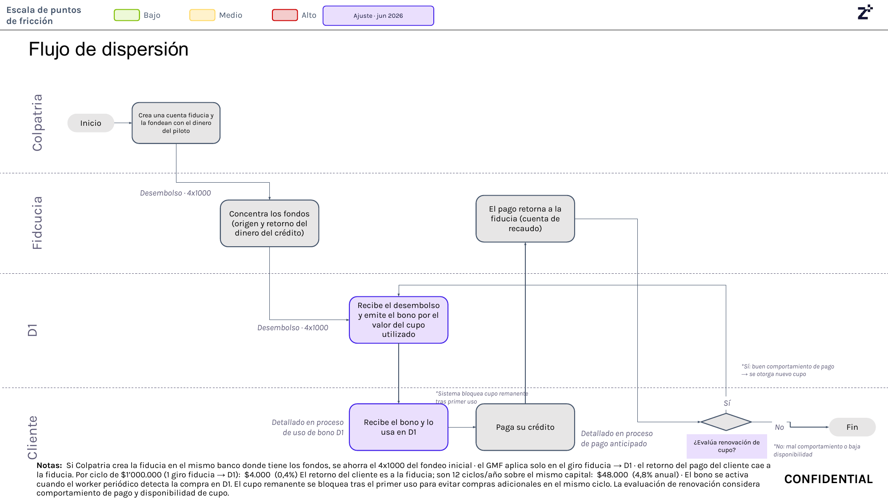

# 6. Dispersión de fondos

## Objetivo

Gestionar el desembolso de los recursos del crédito desde la fiducia hacia D1, emitir el bono correspondiente al cupo aprobado, registrar el uso del crédito por parte del cliente y administrar el retorno de los pagos para evaluar la renovación del cupo en futuros ciclos.

---

## Journey

**Figura 8. Journey de Dispersión de Fondos.**

Este journey describe el flujo financiero del crédito una vez ha sido aprobado y firmado. Durante esta etapa se administran los recursos del crédito mediante una cuenta fiduciaria, se realiza el desembolso hacia D1, se emite el bono para el cliente, se registra el pago del crédito y finalmente se evalúa si el cliente puede recibir una renovación de su cupo.

> **⚠️ Pendiente de ajustar en el diagrama antes de presentar:**
> 1. Diferenciar la flecha Colpatria→Fiducia ("Fondeo inicial · único") de la flecha Fiducia→D1 ("Desembolso · 4x1000 por ciclo") — hoy ambas dicen "Desembolso · 4x1000" y pueden leerse como si el GMF se cobrara dos veces por crédito.
> 2. Aclarar el actor del nodo "¿Evalúa renovación de cupo?" (Sistema / Riesgo), ya que visualmente cae en el carril de Cliente.
> 3. Documentar qué cambió exactamente en junio de 2026 en los dos pasos marcados como "Ajuste · jun 2026" (emisión del bono en D1 y uso del bono por el cliente) — pendiente de confirmar con el dueño del proceso.
> 4. Asignar el nivel de fricción (Bajo/Medio/Alto) a cada paso; ningún paso lo tiene aún pese a que la leyenda del diagrama lo define.
> 5. Aclarar si la rama "Sí" de la renovación de cupo vuelve a iniciar el ciclo en el paso 3 (emisión del bono) — hoy no hay conexión visual de retorno, solo la nota de texto.

*Los elementos marcados con asterisco (\*) corresponden a puntos aún no definidos técnicamente o pendientes de confirmación con el dueño del proceso; se detallan en cada paso y se listan de forma consolidada en "Pendientes de validación".*

---

## Descripción general

Una vez el contrato ha sido firmado y el crédito queda activo, Colpatria crea y fondea una cuenta fiduciaria desde donde se administran los recursos del piloto (**fondeo inicial, único**, no recurrente por crédito). Posteriormente la fiducia desembolsa el dinero a D1 para emitir el bono correspondiente al valor del cupo utilizado (**desembolso recurrente, uno por cada ciclo de crédito**).

Cuando el cliente utiliza el bono en una tienda D1, un **worker periódico**\* detecta la compra (el mismo mecanismo de detección descrito en el documento 5, Calculadora y Cobro del Crédito) y el sistema registra la utilización del crédito, bloqueando el cupo remanente hasta finalizar el ciclo de pago. Posteriormente el cliente paga su obligación y el dinero retorna nuevamente a la fiducia como cuenta de recaudo — este retorno no vuelve a generar GMF adicional. Finalmente, el sistema (Riesgo) analiza el comportamiento de pago y la disponibilidad de cupo para determinar si el cliente puede recibir una renovación de su cupo de crédito; si la renovación es aprobada, se inicia un nuevo ciclo de dispersión desde el paso 3 (emisión del bono).

---

## Explicación paso a paso

Cada paso incluye el **proceso** (qué ocurre técnica u operativamente) y un **tiempo estimado** de referencia, pendiente de validar con Producto/Tecnología/Riesgo.

### 1. Creación y fondeo de la cuenta fiduciaria

**Actor:** Colpatria.

**Proceso:** Colpatria crea una cuenta fiduciaria destinada exclusivamente a administrar los recursos del piloto y la fondea con el capital destinado a los desembolsos. Esta cuenta centraliza tanto la salida del dinero hacia D1 como el retorno de los pagos realizados por los clientes.

**Resultado:** Cuenta fiduciaria creada y fondeada, lista para operar los desembolsos del piloto.

**Tiempo estimado:** Actividad de fondeo puntual, **única al inicio de la operación del piloto** (o cuando se requiera reforzar el fondo) — no ocurre en cada ciclo de crédito, a diferencia del desembolso hacia D1 (paso 3).

**Placeholder\*:** no está definido el monto exacto del fondo fiduciario ni la periodicidad con la que Colpatria debe reforzarlo a medida que se originan más créditos. **Pendiente para mañana:** llevar una cifra tentativa del monto de fondeo inicial, aunque sea preliminar, para no dejar el punto completamente abierto en la presentación.

---

### 2. Concentración de los fondos

**Actor:** Fiducia.

**Proceso:** Todos los recursos del crédito quedan concentrados en la cuenta fiduciaria, la cual administra tanto el origen del dinero de cada desembolso como el recaudo posterior de los pagos de los clientes. Este diseño reduce el impacto del GMF (4x1000), ya que únicamente se genera el movimiento correspondiente entre la fiducia y D1: por ciclo de $1'000.000 (un giro fiducia → D1), el GMF es de $4.000 (0,4%). Sobre el mismo capital, con 12 ciclos al año, esto equivale a $48.000 (4,8% anual). El retorno del pago del cliente hacia la fiducia (cuenta de recaudo) no genera un nuevo GMF adicional.

**Resultado:** Fondos concentrados y listos para el desembolso hacia D1.

**Tiempo estimado:** Instantáneo (los fondos ya están disponibles en la cuenta fiduciaria).

**Placeholder\*:** si Colpatria crea la fiducia en el mismo banco donde ya tiene los fondos, se ahorra adicionalmente el 4x1000 **del fondeo inicial (paso 1)** — no está confirmado si esta condición (mismo banco) se cumplirá en la implementación definitiva. **Este ahorro aplica únicamente al fondeo inicial, no al desembolso recurrente Fiducia→D1 del paso 3, que sí genera GMF en cada ciclo independientemente del banco.**

---

### 3. Desembolso hacia D1 y emisión del bono

**Actor:** Fiducia / D1.

**Proceso:** Cuando el crédito queda disponible, la fiducia realiza el desembolso del valor aprobado hacia D1 (generando el GMF descrito en el paso 2, **0,4% por cada ciclo de crédito**). D1 recibe los recursos y genera un bono equivalente al valor del cupo, el cual queda disponible para que el cliente realice su compra. En esta etapa todavía no existe una obligación financiera activa hasta que el bono sea utilizado.

**Resultado:** Bono emitido y disponible para el cliente.

**Tiempo estimado:** Instantáneo a segundos (transferencia y generación del bono, una vez el crédito está aprobado y firmado).

**Nota (Ajuste · jun 2026):** este paso está marcado en el journey (página 8) como un ajuste de junio de 2026. *(Pendiente para mañana: confirmar con el dueño del proceso qué cambió exactamente en la emisión del bono en esta actualización, para poder explicarlo si se pregunta en la presentación.)*

---

### 4. Uso del bono por parte del cliente

**Actor:** Cliente / Sistema (worker periódico).

**Proceso:** El cliente recibe el bono y realiza la compra en una tienda D1. El bono se activa efectivamente cuando el **worker periódico**\* detecta la compra en D1 (mismo mecanismo de detección del documento 5, paso 2). A partir de esa detección, el sistema registra la utilización efectiva del crédito y comienza formalmente el ciclo de vida de la obligación financiera. Después del primer uso, el sistema bloquea automáticamente el cupo remanente para evitar compras adicionales durante el mismo ciclo de crédito.

**Resultado:** Crédito activado mediante el uso del bono; cupo remanente bloqueado hasta finalizar el ciclo.

**Tiempo estimado:** Depende de la periodicidad del worker periódico (mismo placeholder señalado en el documento 5); no es instantáneo respecto al momento exacto de la compra.

**Placeholder\*:** ver placeholder del documento 5 (paso 2) sobre la periodicidad exacta del worker que detecta el uso del bono; este mismo mecanismo aplica aquí.

**Nota (Ajuste · jun 2026):** este paso también está marcado en el journey como ajuste de junio de 2026. *(Mismo pendiente que el paso 3: confirmar el detalle del ajuste con el dueño del proceso antes de presentar.)*

---

### 5. Pago del crédito

**Actor:** Cliente / Fiducia.

**Proceso:** Cuando llega la fecha de pago, el cliente realiza el pago correspondiente a su obligación (por PSE o débito automático, según el documento 5). El dinero no retorna a D1: se consigna nuevamente en la cuenta fiduciaria, que funciona como cuenta de recaudo del producto, cerrando el ciclo financiero del crédito.

**Resultado:** Pago recibido por la fiducia; ciclo financiero cerrado.

**Tiempo estimado:** Depende del método de pago utilizado (ver documento 5: PSE es prácticamente inmediato; débito automático ocurre en la fecha de corte, sujeto además a los tiempos de la red ACH — ver documento 5, paso 6b).

---

### 6. Evaluación para renovación del cupo

**Actor:** Sistema / Riesgo *(no requiere acción del cliente — aclarar esto en el diagrama, donde el nodo hoy queda visualmente dentro del carril "Cliente")*.

**Proceso:** Una vez registrado el pago, el sistema analiza el comportamiento de pago del cliente y la disponibilidad de cupo para determinar si puede otorgarse una nueva disponibilidad de crédito. Si el cliente presenta buen comportamiento de pago y existe disponibilidad de cupo, el sistema puede renovar automáticamente su línea de crédito para un nuevo ciclo; en caso contrario, el proceso finaliza sin renovación.

**Resultado:** Decisión sobre la renovación del cupo (renovado o finalizado sin renovación).

- **Sí (renovado):** se otorga nuevo cupo y **se inicia un nuevo ciclo de dispersión, retomando el proceso en el paso 3** (desembolso hacia D1 y emisión de un nuevo bono).
- **No:** el proceso finaliza (Fin) por mal comportamiento de pago o baja disponibilidad de cupo.

**Tiempo estimado:** Instantáneo a segundos, si la evaluación es automática (pendiente de confirmar el detalle del cálculo).

**Placeholder\*:** las políticas exactas de renovación del cupo (criterios de "buen comportamiento de pago", reglas de disponibilidad) deben confirmarse con el equipo de Riesgo antes de la versión definitiva de este proceso.

---

## Reglas de negocio

- Colpatria debe crear y fondear la cuenta fiduciaria antes de realizar cualquier desembolso. **Este fondeo es un evento único al inicio del piloto (no se repite por cada crédito).**
- Todos los desembolsos del piloto se realizan desde la cuenta fiduciaria hacia D1. **Este desembolso sí es recurrente: ocurre una vez por cada ciclo de crédito y genera GMF en cada ocasión.**
- D1 únicamente recibe los recursos para emitir el bono correspondiente al cliente.
- El bono representa el valor del cupo utilizado por el cliente.
- El crédito se considera utilizado únicamente cuando el bono es redimido en una tienda D1, y su detección depende del worker periódico que revisa las compras en D1.
- Después del primer uso del bono, el sistema bloquea el cupo remanente hasta finalizar el ciclo.
- Los pagos del cliente retornan siempre a la cuenta fiduciaria, sin generar GMF adicional en ese retorno.
- El GMF del modelo aplica únicamente sobre el giro fiducia → D1 (0,4% por ciclo sobre el capital desembolsado); **el fondeo inicial Colpatria→Fiducia es un evento aparte y puede generar GMF propio, salvo que la fiducia esté en el mismo banco donde Colpatria tiene los fondos.**
- Si la fiducia se crea en el mismo banco donde Colpatria tiene los fondos, se ahorra el 4x1000 **del fondeo inicial únicamente** (no exime el GMF del desembolso recurrente a D1).
- La renovación del cupo depende del comportamiento de pago y de la disponibilidad definida por la política de crédito, a confirmar con Riesgo. **Una renovación aprobada ("Sí") reinicia el ciclo de dispersión en el paso 3.**

---

## Entradas

- Crédito aprobado y firmado.
- Recursos disponibles para el piloto.
- Cuenta fiduciaria creada.
- Valor del cupo aprobado.
- Información del cliente.
- Compra realizada en D1 (detectada por el worker periódico).
- Pago realizado por el cliente.

---

## Salidas

- Recursos desembolsados hacia D1.
- Bono emitido al cliente.
- Crédito activado mediante el uso del bono.
- Pago recibido por la fiducia.
- Decisión sobre la renovación del cupo (incluye, si es "Sí", el reinicio del ciclo en el paso 3).

---

## Excepciones

- La cuenta fiduciaria no puede ser creada o fondeada.
- El desembolso hacia D1 falla.
- El bono no puede emitirse correctamente.
- El cliente no utiliza el bono.
- El worker periódico no detecta oportunamente la compra en D1 (retraso en la activación del bono).
- El cliente no realiza el pago del crédito.
- El pago no retorna correctamente a la fiducia.
- El cliente no cumple las políticas para renovar el cupo.

---

## Consideraciones

- La cuenta fiduciaria concentra tanto el origen como el recaudo de los recursos del crédito.
- El modelo reduce el impacto del GMF (4x1000): solo se genera en el giro fiducia → D1 (0,4% por ciclo de $1'000.000, equivalente a $48.000 al año sobre 12 ciclos del mismo capital); el retorno del pago del cliente a la fiducia no genera GMF adicional.
- Si Colpatria crea la fiducia en el mismo banco donde tiene los fondos, se ahorra además el 4x1000 del fondeo inicial (evento único, distinto del desembolso recurrente por ciclo).
- El crédito inicia efectivamente cuando el bono es utilizado por el cliente y detectado por el worker periódico (mismo mecanismo del documento 5, Calculadora y Cobro del Crédito).
- El bloqueo del cupo remanente evita nuevas compras durante el mismo ciclo.
- La renovación del cupo corresponde a una evaluación posterior al pago, considera comportamiento de pago y disponibilidad de cupo, y depende de las políticas vigentes de Riesgo. Una renovación aprobada reinicia el ciclo desde el paso 3.
- **Aún no se ha asignado nivel de fricción (Bajo/Medio/Alto) a ninguno de los pasos de este journey; se recomienda hacerlo antes de la siguiente versión del diagrama.**

---

## Notas

- El cálculo del GMF mostrado en el journey corresponde al diseño financiero del piloto y puede modificarse en futuras versiones del producto.
- Las políticas de renovación del cupo deberán confirmarse con el equipo de Riesgo antes de la versión definitiva de la documentación.
- El monto del fondo fiduciario y las reglas de renovación son parámetros sujetos a cambios durante la evolución del producto.
- Los dos pasos marcados como "Ajuste · jun 2026" en el diagrama (emisión del bono y uso del bono) requieren confirmación del dueño del proceso sobre qué cambió exactamente, para dejarlo documentado en la próxima versión.

---

## Pendientes de validación

> **Pendiente de validar con el dueño del proceso (para mañana):**
>
> - Confirmar el monto exacto del fondo fiduciario y la periodicidad con la que debe reforzarse; llevar al menos una cifra tentativa. *(placeholder — paso 1)*
> - Confirmar si la cuenta fiduciaria se creará en el mismo banco donde Colpatria tiene los fondos, para efectos del ahorro adicional de GMF en el fondeo inicial. *(placeholder — paso 2)*
> - Confirmar qué cambió exactamente en junio de 2026 en la emisión del bono (paso 3) y en el uso del bono por el cliente (paso 4), marcados como "Ajuste · jun 2026" en el diagrama. *(nuevo — pasos 3 y 4)*
> - Confirmar la periodicidad exacta del worker que detecta el uso del bono en D1 (mismo pendiente señalado en el documento 5, paso 2). *(placeholder — paso 4)*
> - Confirmar con el equipo de Riesgo las políticas exactas de renovación del cupo (criterios de comportamiento de pago y disponibilidad). *(placeholder — paso 6)*
> - Asignar el nivel de fricción (Bajo/Medio/Alto) a cada paso del journey, conforme a la leyenda del diagrama. *(nuevo — todo el journey)*
> - Definir si se debe agregar una conexión visual explícita en el diagrama para la rama "Sí" de renovación, mostrando el reinicio del ciclo en el paso 3. *(nuevo — paso 6)*

---

## Fuentes consultadas

- *Journeys Colpatria B2B* (junio de 2026), página 8.
- Documentación del modelo operativo del producto.
- Documento de alcance del producto.
- Validación del diagrama "Flujo de dispersión" realizada previo a la presentación (identificación de discrepancias entre fondeo inicial y desembolso recurrente, actor del nodo de renovación, ajustes de junio 2026 sin documentar, niveles de fricción pendientes y loop de renovación).
