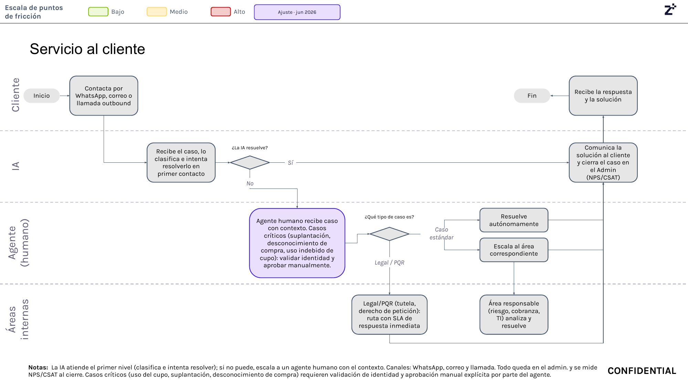

# 11. Servicio al cliente

## Objetivo

Atender los casos del cliente de forma rápida y responsable, resolviendo de primera línea o derivando correctamente a las áreas competentes cuando el tema requiere intervención humana.

## Journey

El recorrido se explica a continuación en texto narrativo, y la imagen del journey sirve como referencia visual para validar la secuencia operativa.

- Página 9 del journey Colpatria B2B (junio 2026): servicio al cliente, IA de primer nivel y escalamiento humano.
- Fuente visual de respaldo para validar la secuencia documentada en este proceso.

## Explicación del Journey

1. Contacto del cliente
   - Qué sucede: el cliente reporta un caso por WhatsApp, correo o llamada outbound.
   - Qué actor interviene: cliente.
   - Qué sistema participa: canal de contacto y portal administrativo.
   - Qué información se utiliza: descripción del caso y contexto del cliente.
   - Qué decisión se toma: si el caso entra al proceso de servicio al cliente.
   - Qué ocurre si el resultado es positivo: el caso se registra y se clasifica.
   - Qué ocurre si el resultado es negativo: no se genera un caso.

2. Primer contacto con la IA
   - Qué sucede: la IA clasifica el caso e intenta resolverlo en primer contacto.
   - Qué actor interviene: IA.
   - Qué sistema participa: motor de clasificación y respuesta.
   - Qué información se utiliza: contexto del caso, historial y reglas de respuesta.
   - Qué decisión se toma: si la IA resuelve o no el reclamo.
   - Qué ocurre si el resultado es positivo: se cierra el caso.
   - Qué ocurre si el resultado es negativo: se escapa al agente humano.

3. Revisión humana del caso
   - Qué sucede: un agente humano recibe el caso con contexto y valida identidad si se trata de un caso crítico.
   - Qué actor interviene: agente humano.
   - Qué sistema participa: portal administrativo.
   - Qué información se utiliza: contexto del caso y verificación de identidad.
   - Qué decisión se toma: si el caso es estándar, crítico o legal/PQR.
   - Qué ocurre si el resultado es positivo: se resuelve o se enruta.
   - Qué ocurre si el resultado es negativo: se mantiene en espera o se escalada a la área responsable.

4. Enrutamiento final
   - Qué sucede: el caso se resuelve de forma autónoma, se deriva a riesgo/cobranza/TI o se envía a legal/PQR.
   - Qué actor interviene: agente humano y áreas internas.
   - Qué sistema participa: enrutamiento del caso y SLA.
   - Qué información se utiliza: tipo de caso y nivel de impacto.
   - Qué decisión se toma: qué área asume la respuesta.
   - Qué ocurre si el resultado es positivo: el cliente recibe la solución.
   - Qué ocurre si el resultado es negativo: se mantiene en seguimiento.

## Reglas de negocio

- Todo caso debe registrarse en el portal administrativo.
- La IA intenta resolver el caso en primer contacto.
- Los casos críticos requieren validación de identidad y aprobación manual.
- El enrutamiento final puede ser resolución autónoma, escalación a riesgo/cobranza/TI o legal/PQR.

## Entradas

- Caso reportado por WhatsApp, correo o llamada outbound.
- Contexto del cliente y del problema.
- Reglas de clasificación y routing del servicio.

## Salidas

- Caso resuelto o derivado.
- Respuesta al cliente con solución o seguimiento.
- Cierre del caso en el admin con métricas NPS/CSAT.

## Excepciones

- El caso no lo resuelve la IA y debe pasar a agente humano.
- El caso es crítico y requiere validación de identidad.
- El caso corresponde a legal/PQR y necesita SLA inmediato.
- Se detecta un fraude o uso indebido de cupo.

## Pendientes de validación

> **Pendiente de validar con el dueño del proceso.**

