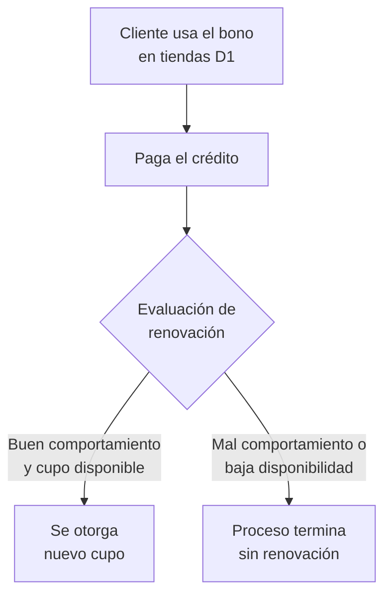

# 7. Uso y renovación del cupo

[← Volver a Procesos](README.md)

| Documento | Uso y renovación del cupo |
|-----------|------------------------------|
| **Proyecto** | Fliipa |
| **Versión** | 2.1 |
| **Estado** | Borrador para validación |
| **Responsable** | Riesgo y crédito |
| **Última actualización** | 2026-07-13 |

---

## Control de versiones

| Versión | Fecha | Autor | Descripción |
|---------|-------|-------|-------------|
| 1.0 | 2026-07-09 | María Fernanda Herazo  | Versión inicial, como sección 7 del `procesos.md` original (monolítico). |
| 2.0 | 2026-07-13 | María Fernanda Herazo  | Reorganización en archivo independiente con diagrama Mermaid, dentro del split de `negocio/procesos/`. |
| 2.1 | 2026-07-13 | María Fernanda Herazo | Se valida contra la página 8 de `Journeys Fran finales.pdf`: el contenido ya era correcto, sin cambios de flujo. Se agrega esta tabla de control de versiones y la referencia cruzada a [06-dispersion-fondos.md](06-dispersion-fondos.md), que documenta la misma decisión de renovación dentro del flujo de dispersión. |

---

## Flujo

La renovación depende del **comportamiento de pago** y de la **disponibilidad de cupo**.

> **Nota de alcance:** esta misma decisión de renovación aparece también en [06-dispersion-fondos.md](06-dispersion-fondos.md), como parte del mismo diagrama de la página 8 del journey (después de que el pago del cliente retorna a la fiducia). Conviene mantener ambas versiones alineadas si alguna cambia.

## Fuentes consultadas

- `Journeys Fran finales.pdf` (Journeys Colpatria B2B, junio 2026), página 8 ("Flujo de dispersión", swimlane Cliente)
