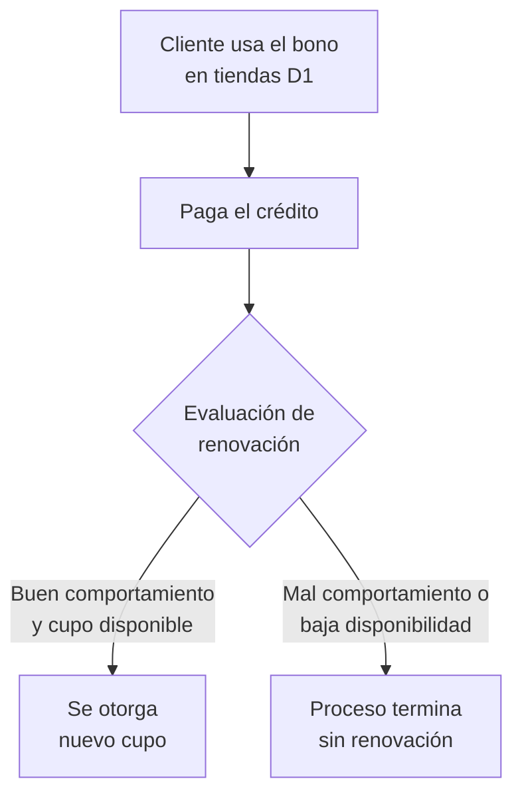

# 7. Uso y renovación del cupo

[← Volver a Procesos](README.md)

## Flujo

```mermaid
flowchart TD
    A[Cliente usa el bono\nen tiendas D1] --> B[Paga el crédito]
    B --> C{Evaluación de\nrenovación}
    C -->|Buen comportamiento\ny cupo disponible| D[Se otorga\nnuevo cupo]
    C -->|Mal comportamiento o\nbaja disponibilidad| E[Proceso termina\nsin renovación]
```

La renovación depende del **comportamiento de pago** y de la **disponibilidad de cupo**.
