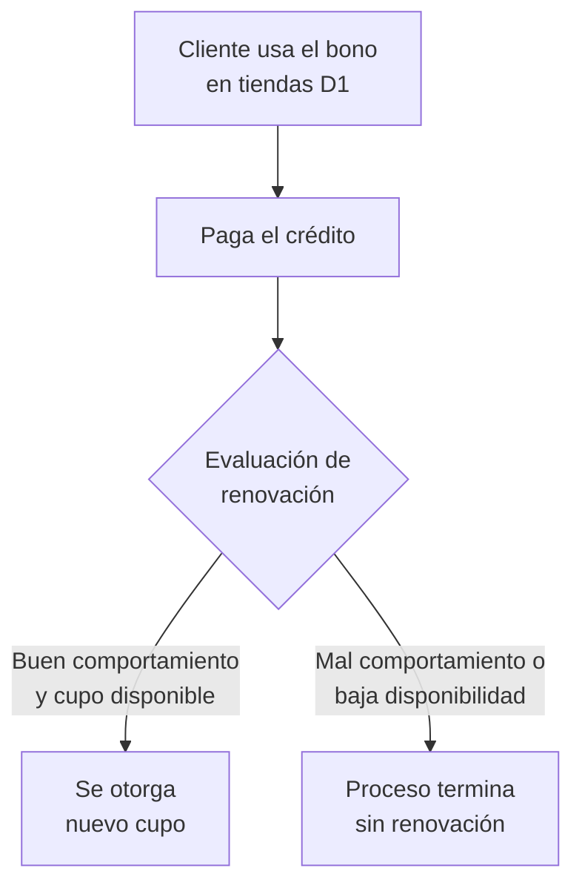

# 7. Uso y renovación del cupo

[← Volver a Procesos](README.md)

| Documento | Uso y renovación del cupo |
|-----------|------------------------------|
| **Proyecto** | Fliipa |
| **Versión** | 2.1 |
| **Estado** | Borrador para validación |
| **Responsable** | Riesgo y crédito |
| **Última actualización** | 2026-07-13 |

---

## Control de versiones

| Versión | Fecha | Autor | Descripción |
|---------|-------|-------|-------------|
| 1.0 | 2026-07-09 | María Fernanda Herazo  | Versión inicial, como sección 7 del `procesos.md` original (monolítico). |
| 2.0 | 2026-07-13 | María Fernanda Herazo  | Reorganización en archivo independiente con diagrama Mermaid, dentro del split de `negocio/procesos/`. |
| 2.1 | 2026-07-13 | María Fernanda Herazo | Se valida contra la página 8 de `Journeys Fran finales.pdf`: el contenido ya era correcto, sin cambios de flujo. Se agrega esta tabla de control de versiones y la referencia cruzada a [06-dispersion-fondos.md](06-dispersion-fondos.md), que documenta la misma decisión de renovación dentro del flujo de dispersión. |

## Objetivo

Definir si un cliente califica para recibir un nuevo cupo después de usar el bono y cumplir con el comportamiento esperado de pago.

## Descripción general

Una vez el cliente usa el bono en D1 y paga su crédito, se evalúa si la relación continua y si existe capacidad de cupo disponible para otorgar una renovación. La decisión final depende de dos condiciones: buen comportamiento de pago y disponibilidad de cupo.

## Actores involucrados

- Cliente: usa el bono y paga el crédito.
- D1: registra el uso del bono y confirma el consumo.
- Riesgo y crédito: evalúa la renovación del cupo.
- Sistema: ejecuta la decisión de renovación y actualiza el estado del cupo.

## Flujo del proceso

## Referencia visual del journey

- Página 8 del journey Colpatria B2B (junio 2026): uso del bono, pago del crédito y decisión de renovación del cupo.
- Fuente visual de respaldo para validar la secuencia documentada en este proceso.

## Explicación paso a paso

1. Uso del bono en D1
   - Qué sucede: el cliente usa el bono en las tiendas D1.
   - Qué actor interviene: cliente y D1.
   - Qué sistema participa: plataforma de consumo del bono.
   - Qué información se utiliza: uso del bono y estado del cupo.
   - Qué decisión se toma: si el crédito se moviliza de forma válida.
   - Qué ocurre si el resultado es positivo: se continúa a la evaluación de pago.
   - Qué ocurre si el resultado es negativo: no se activa la renovación.

2. Pago del crédito
   - Qué sucede: el cliente paga su obligación según el plan de pagos.
   - Qué actor interviene: cliente.
   - Qué sistema participa: flujo de pagos y recaudo.
   - Qué información se utiliza: historia de pagos y saldo del crédito.
   - Qué decisión se toma: si el cliente demuestra buen comportamiento.
   - Qué ocurre si el resultado es positivo: entra a la evaluación de renovación.
   - Qué ocurre si el resultado es negativo: se cierra la posibilidad de renovación.

3. Evaluación de renovación
   - Qué sucede: se valida si el cliente mantiene un buen comportamiento de pago y si hay cupo disponible.
   - Qué actor interviene: riesgo y crédito.
   - Qué sistema participa: motor de renovación del cupo.
   - Qué información se utiliza: historial de pagos y capacidad de cupo.
   - Qué decisión se toma: si se otorga nuevo cupo.
   - Qué ocurre si el resultado es positivo: se otorga el nuevo cupo.
   - Qué ocurre si el resultado es negativo: se termina el proceso sin renovación.

## Reglas de negocio

- La renovación depende del comportamiento de pago.
- La renovación requiere cupo disponible.
- Si el comportamiento es deficiente o el cupo no está disponible, no se otorga renovación.

## Entradas

- Uso del bono registrado en D1.
- Pago del crédito realizado por el cliente.
- Estado del cupo disponible.

## Salidas

- Nuevo cupo otorgado o no otorgado.
- Continuidad o terminación de la relación de crédito.

## Excepciones

- El cliente no paga o incurre en mal comportamiento.
- No existe cupo disponible para renovar.
- El caso queda fuera de la política actual de renovación.

## Consideraciones

- Esta decisión también aparece en [06-dispersion-fondos.md](06-dispersion-fondos.md), porque el flujo de dispersión y el flujo de renovación comparten el mismo punto de decisión.
- La política exacta de renovación debe mantenerse alineada con negocio y riesgo.

## Pendientes de validación

> **Pendiente de validar con el dueño del proceso.** La regla exacta de renovación del cupo y los criterios de disponibilidad deben confirmarse con negocio y riesgo.

## Fuentes consultadas

- `Journeys Fran finales.pdf` (Journeys Colpatria B2B, junio 2026), página 8 ("Flujo de dispersión", swimlane Cliente)
