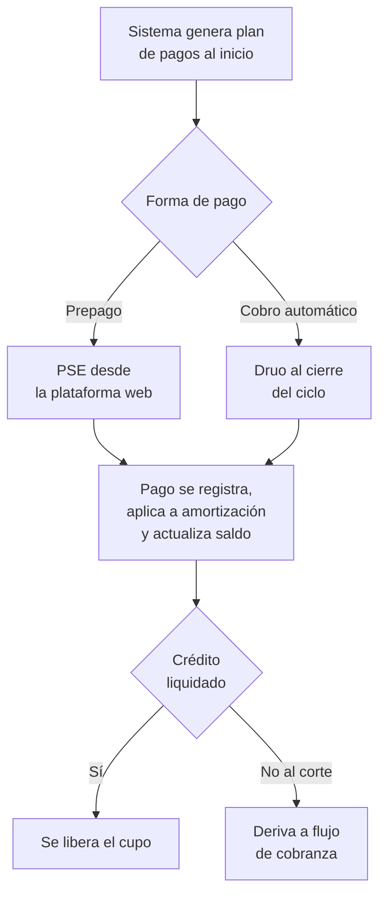

# 8. Cobro y pago del crédito

[← Volver a Procesos](README.md)

## Flujo

```mermaid
flowchart TD
    A[Sistema genera plan\nde pagos al inicio] --> B{Forma de pago}
    B -->|Prepago| C[PSE desde\nla plataforma web]
    B -->|Cobro automático| D[Druo al cierre\ndel ciclo]
    C --> E[Pago se registra,\naplica a amortización\ny actualiza saldo]
    D --> E
    E --> F{Crédito\nliquidado}
    F -->|Sí| G[Se libera el cupo]
    F -->|No al corte| H[Deriva a flujo\nde cobranza]
```
