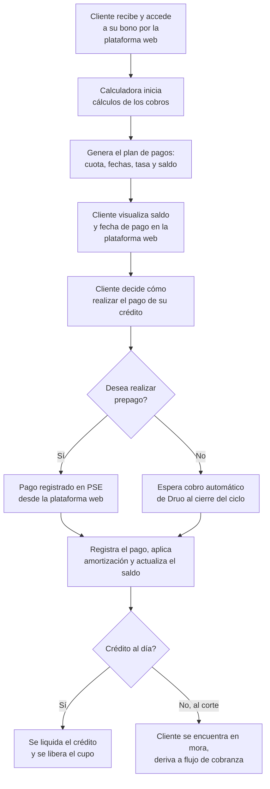

# 8. Cobro y pago del crédito

[← Volver a Procesos](README.md)

| Documento | Cobro y pago del crédito |
|-----------|------------------------------|
| **Proyecto** | Fliipa |
| **Versión** | 2.1 |
| **Estado** | Borrador para validación |
| **Responsable** | Riesgo y crédito |
| **Última actualización** | 2026-07-13 |

---

## Control de versiones

| Versión | Fecha | Autor | Descripción |
|---------|-------|-------|-------------|
| 1.0 | 2026-07-09 | María Fernanda Herazo | Versión inicial, como sección 8 del `procesos.md` original (monolítico). |
| 2.0 | 2026-07-13 | María Fernanda Herazo | Reorganización en archivo independiente con diagrama Mermaid, dentro del split de `negocio/procesos/`. |
| 2.1 | 2026-07-13 | María Fernanda Herazo  | Corrección solicitada tras validar contra la página 7 de `Journeys Fran finales.pdf`: se agrega el origen del proceso (worker periódico detecta el uso del bono, cliente accede a su bono, calculadora inicia cálculos); se agregan los dos pasos del cliente entre el plan de pagos y la decisión de prepago (visualiza saldo y fecha, decide cómo pagar); se precisa que al liquidar también se liquida el crédito, no solo se libera el cupo. |

---

## Flujo

> **Nota:** el crédito se origina cuando el worker periódico detecta el uso del bono en D1 — este disparador conecta con el flujo descrito en [06-dispersion-fondos.md](06-dispersion-fondos.md).

## Fuentes consultadas

- `Journeys Fran finales.pdf` (Journeys Colpatria B2B, junio 2026), página 7 ("Calculadora / cobro del crédito", swimlanes Cliente / Calculadora / Medios de pago)
