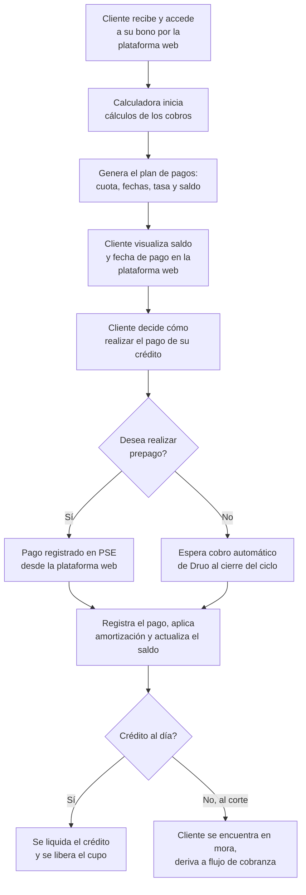

# 8. Cobro y pago del crédito

[← Volver a Procesos](README.md)

| Documento | Cobro y pago del crédito |
|-----------|------------------------------|
| **Proyecto** | Fliipa |
| **Versión** | 2.1 |
| **Estado** | Borrador para validación |
| **Responsable** | Riesgo y crédito |
| **Última actualización** | 2026-07-13 |

---

## Control de versiones

| Versión | Fecha | Autor | Descripción |
|---------|-------|-------|-------------|
| 1.0 | 2026-07-09 | María Fernanda Herazo | Versión inicial, como sección 8 del `procesos.md` original (monolítico). |
| 2.0 | 2026-07-13 | María Fernanda Herazo | Reorganización en archivo independiente con diagrama Mermaid, dentro del split de `negocio/procesos/`. |
| 2.1 | 2026-07-13 | María Fernanda Herazo  | Corrección solicitada tras validar contra la página 7 de `Journeys Fran finales.pdf`: se agrega el origen del proceso (worker periódico detecta el uso del bono, cliente accede a su bono, calculadora inicia cálculos); se agregan los dos pasos del cliente entre el plan de pagos y la decisión de prepago (visualiza saldo y fecha, decide cómo pagar); se precisa que al liquidar también se liquida el crédito, no solo se libera el cupo. |

## Objetivo

Generar el plan de pagos del crédito, registrar los pagos del cliente y actualizar el estado del saldo hasta liquidar o mover el caso a cobranza cuando no se cumpla con el pago.

## Descripción general

El proceso se activa cuando un worker periódico detecta el uso del bono en D1. A partir de ahí, el cliente accede a su bono en la plataforma web, la calculadora genera el plan de pagos y el cliente visualiza el saldo y la fecha de pago para decidir si paga por prepago o espera el cobro automático al cierre del ciclo. El pago se registra, se amortiza el crédito y se actualiza el saldo; si el crédito queda al día, se liquida por completo y se libera el cupo; si no, el caso pasa a cobranza.

## Actores involucrados

- Cliente: accede al bono, visualiza el plan de pagos y decide cómo pagar.
- Calculadora: genera el plan de pagos y los cálculos del crédito.
- Plataforma web: muestra saldo, fecha y medios de pago.
- PSE y Druo: reciben los pagos o el cobro automático.
- Riesgo y cobranza: reciben el caso cuando el crédito no queda al día.

## Flujo del proceso

## Referencia visual del journey

- Página 7 del journey Colpatria B2B (junio 2026): calculadora, plan de pagos, prepago y liquidación del crédito.
- Fuente visual de respaldo para validar la secuencia documentada en este proceso.

## Explicación paso a paso

1. Detección del uso del bono
   - Qué sucede: un worker periódico detecta que el cliente usó el bono en D1.
   - Qué actor interviene: sistema y D1.
   - Qué sistema participa: proceso de detección del uso del bono.
   - Qué información se utiliza: evento de consumo del bono.
   - Qué decisión se toma: si se inicia la generación del crédito y del plan de pagos.
   - Qué ocurre si el resultado es positivo: se crea el plan de pago.
   - Qué ocurre si el resultado es negativo: el proceso no avanza.

2. Generación del plan de pagos
   - Qué sucede: la calculadora inicia los cálculos de cobro y genera la cuota, fechas, tasa y saldo.
   - Qué actor interviene: calculadora y sistema.
   - Qué sistema participa: cálculo del crédito.
   - Qué información se utiliza: monto del crédito, tasa y fechas de corte.
   - Qué decisión se toma: si se construye el plan de pagos.
   - Qué ocurre si el resultado es positivo: el cliente visualiza su obligación.
   - Qué ocurre si el resultado es negativo: se debe corregir la información del crédito.

3. Visualización de saldo y fecha de pago
   - Qué sucede: el cliente revisa su saldo y la fecha de pago en la plataforma web.
   - Qué actor interviene: cliente y plataforma web.
   - Qué sistema participa: plataforma de crédito.
   - Qué información se utiliza: saldo, fecha y plan de pagos.
   - Qué decisión se toma: si el cliente decide pagar antes o esperar el débito automático.
   - Qué ocurre si el resultado es positivo: el cliente define su forma de pago.
   - Qué ocurre si el resultado es negativo: se quedan pendientes de pago.

4. Pago por prepago o débito automático
   - Qué sucede: el cliente realiza un prepago por PSE o espera el cobro automático al cierre del ciclo.
   - Qué actor interviene: cliente, PSE y Druo.
   - Qué sistema participa: medios de pago y cobro automático.
   - Qué información se utiliza: forma de pago y saldo del crédito.
   - Qué decisión se toma: si el pago entra o no al sistema.
   - Qué ocurre si el resultado es positivo: se registra el pago.
   - Qué ocurre si el resultado es negativo: el caso puede pasar a mora o cobranza.

5. Actualización del saldo y amortización
   - Qué sucede: el sistema registra el pago, aplica amortización y actualiza el saldo del crédito.
   - Qué actor interviene: sistema.
   - Qué sistema participa: motor de amortización.
   - Qué información se utiliza: pago recibido y saldo vigente.
   - Qué decisión se toma: si el crédito queda al día.
   - Qué ocurre si el resultado es positivo: se liquida el crédito.
   - Qué ocurre si el resultado es negativo: se deriva a cobranza.

## Reglas de negocio

- El proceso se activa cuando el sistema detecta el uso del bono en D1.
- El cliente puede pagar por prepago o esperar el cobro automático al cierre del ciclo.
- El pago registrado se convierte en amortización y actualiza el saldo del crédito.
- Si el crédito queda al día, se liquida y se libera el cupo.
- Si no, el caso se deriva a cobranza.

## Entradas

- Uso del bono detectado en D1.
- Datos del crédito, tasa y plan de pagos.
- Pago del cliente por PSE o débito automático.

## Salidas

- Plan de pagos generado.
- Pago registrado y saldo actualizado.
- Crédito liquidado o derivado a cobranza.

## Excepciones

- El pago no se registra correctamente.
- El cliente no paga y entra en mora.
- El crédito no queda al día al cierre del ciclo.
- El cupo no se libera porque la liquidación no concluye.

## Consideraciones

- El disparador operativo del proceso se conecta con [06-dispersion-fondos.md](06-dispersion-fondos.md).
- El flujo de pago es clave para la continuidad del cupo y para definir si el cliente debe pasar a cobranza.

## Pendientes de validación

> **Pendiente de validar con el dueño del proceso.** La regla exacta de cálculo del plan de pagos y de los plazos de cobro automático deben confirmarse con negocio y operaciones.

## Fuentes consultadas

- `Journeys Fran finales.pdf` (Journeys Colpatria B2B, junio 2026), página 7 ("Calculadora / cobro del crédito", swimlanes Cliente / Calculadora / Medios de pago)
