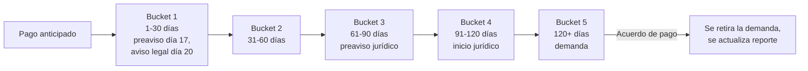

# 9. Gestión de cobranza por bucket de mora

[← Volver a Procesos](README.md)

| Documento | Gestión de cobranza por bucket de mora |
|-----------|-------------------------------------------|
| **Proyecto** | Fliipa |
| **Versión** | 2.1 |
| **Estado** | Borrador para validación |
| **Responsable** | Cobranza y cartera |
| **Última actualización** | 2026-07-13 |

---

## Control de versiones

| Versión | Fecha | Autor | Descripción |
|---------|-------|-------|-------------|
| 1.0 | 2026-07-09 | María Fernanda Herazo  Versión inicial, como sección 9 del `procesos.md` original (monolítico). |
| 2.0 | 2026-07-13 | María Fernanda Herazo  | Reorganización en archivo independiente con diagrama Mermaid y nota de inconsistencia en tabla, dentro del split de `negocio/procesos/`. |
| 2.1 | 2026-07-13 | María Fernanda Herazo | Corrección de 3 errores detectados al validar contra `Mensajes WhatsApp B2B.xlsx` y la página 10 de `Journeys Fran finales.pdf`: (1) Bucket 1 ahora cita día 17 (preaviso informativo), día 20 (aviso legal, Ley 2157 de 2021 Art. 3) y día 30 (aviso previo final) en vez de "preaviso día 15" sin base legal, corrigiendo también que el día 30 pertenece al rango de Bucket 1 (1-30 días), no al de Bucket 2; (2) en la nota de inconsistencia, la "llamada de confirmación de causa" se reubica en el día 6-15 (no día 16-30, que corresponde a la reestructuración/acuerdo de pago y al reporte a centrales); (3) se agrega el paso final "castigo de cartera según política" que faltaba. |

---

La cartera se segmenta en seis estados. La gestión se mantiene activa en todos ellos mediante llamadas, correos y WhatsApp, y **la cobranza inicia desde la originación del crédito, no desde la mora**.

## Buckets de mora

| Bucket | Rango | Acciones principales |
|--------|-------|------------------------|
| Pago anticipado | Antes del vencimiento | Visita de originación; mensajes de bienvenida por WhatsApp (día -5, -3, -1, 0); visita de confirmación y verificación el día 25 (contacto, medios de pago, inventario) |
| Bucket 1 | 1–30 días | Llamada con guion estandarizado; WhatsApp informativo desde el día 3; **preaviso informativo de posible reporte (día 17)**; **aviso legal formal citando el Art. 3 de la Ley 2157 de 2021 (día 20)**; **aviso previo final antes de reporte (día 30)**; priorización de visita según Comité de Cartera |
| Bucket 2 | 31–60 días | Llamada para negociar y dar seguimiento a compromisos; comunicaciones por WhatsApp y correo |
| Bucket 3 | 61–90 días | Email de preaviso de proceso jurídico |
| Bucket 4 | 91–120 días | Aviso formal de inicio de proceso jurídico (email y carta física); contacto directo del analista jurídico o abogado |
| Bucket 5 | 120+ días | Definición de cuantía y juzgado; radicación de la demanda; verificación de datos de notificación; canal de negociación solo dentro del proceso legal, condicionado a pago inicial y compromiso documentado |

## Comité de Cartera

| Frecuencia | Criterios de priorización |
|------------|----------------------------|
| Semanal | Días de mora (foco en 20+), flujo de caja y tipo de negocio, cuotas vencidas, historial y respuesta del cliente, monto adeudado alto |

## ⚠️ Nota de inconsistencia (pendiente de validar)

El journey de Colpatria B2B (junio 2026) describe un flujo **más corto** que el esquema de buckets anterior:

| Journey Colpatria B2B | Esquema de buckets (este documento) |
|---|---|
| Día 0: débito automático (Druo) | — |
| Día 1–5: reintento de débito automático | — |
| Día 6–15: WhatsApp/SMS con preaviso de reporte a 15 días **y** llamada de confirmación de causa (guion estandarizado) + bloqueo de cupo | Bucket 1: preaviso día 17, aviso legal día 20 (Ley 2157) |
| Día 16–30: reestructuración o acuerdo de pago (o castigo parcial con cancelación de cupo); si no acepta, reporte a centrales de riesgo (día 15 de mora / día 45 del crédito) | Bucket 1: aviso previo final día 30 |
| Cliente continúa sin pagar → **castigo de cartera según política**; bloqueo permanente de cupo (día 30 de mora); se inicia cobro jurídico | Escalamiento jurídico entre bucket 3 y 5, es decir **61 a 120+ días** |

Ambos flujos quedan documentados hasta que negocio y operaciones confirmen cuál está vigente (la misma nota aplica en [Reglas Negocio](../reglas-negocio.md)).

## Fuentes consultadas

- `Mensajes WhatsApp B2B.xlsx` (días exactos de preaviso/aviso y cita de la Ley 2157 de 2021, Art. 3)
- `Journeys Fran finales.pdf` (Journeys Colpatria B2B, junio 2026), página 10 ("Cobranza", swimlanes Cliente / Sistema / Analista de cobranza / Legal-Jurídico)

