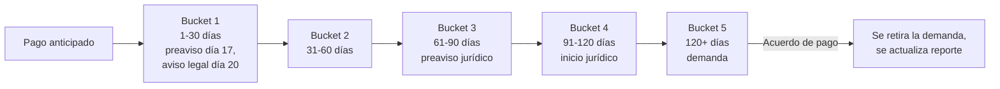

# 9. Gestión de cobranza por bucket de mora

[← Volver a Procesos](README.md)

| Documento | Gestión de cobranza por bucket de mora |
|-----------|-------------------------------------------|
| **Proyecto** | Fliipa |
| **Versión** | 2.1 |
| **Estado** | Borrador para validación |
| **Responsable** | Cobranza y cartera |
| **Última actualización** | 2026-07-13 |

---

## Control de versiones

| Versión | Fecha | Autor | Descripción |
|---------|-------|-------|-------------|
| 1.0 | 2026-07-09 | María Fernanda Herazo | Versión inicial, como sección 9 del `procesos.md` original (monolítico). |
| 2.0 | 2026-07-13 | María Fernanda Herazo | Reorganización en archivo independiente con diagrama Mermaid y nota de inconsistencia en tabla, dentro del split de `negocio/procesos/`. |
| 2.1 | 2026-07-13 | María Fernanda Herazo | Corrección de 3 errores detectados al validar contra `Mensajes WhatsApp B2B.xlsx` y la página 10 de `Journeys Fran finales.pdf`: (1) Bucket 1 ahora cita día 17 (preaviso informativo), día 20 (aviso legal, Ley 2157 de 2021 Art. 3) y día 30 (aviso previo final) en vez de "preaviso día 15" sin base legal, corrigiendo también que el día 30 pertenece al rango de Bucket 1 (1-30 días), no al de Bucket 2; (2) en la nota de inconsistencia, la "llamada de confirmación de causa" se reubica en el día 6-15 (no día 16-30, que corresponde a la reestructuración/acuerdo de pago y al reporte a centrales); (3) se agrega el paso final "castigo de cartera según política" que faltaba. |

## Objetivo

Gestionar la mora del crédito desde la originación y aplicar la estrategia de cobranza adecuada según el bucket en que se encuentre el cliente.

## Descripción general

La cartera se segmenta en seis estados. La gestión se mantiene activa en todos ellos mediante llamadas, correos y WhatsApp, y la cobranza inicia desde la originación del crédito, no desde la mora. La estrategia varía según la antigüedad de la obligación, la severidad del atraso y la necesidad de escalar a procesos jurídicos o de castigo de cartera.

## Actores involucrados

- Cliente: recibe los mensajes de cobranza y responde o negocia pagos.
- Cobranza y cartera: ejecutan las acciones de seguimiento y priorización por bucket.
- Comité de Cartera: prioriza casos con mayor riesgo o mora.
- Área jurídica: interviene en los buckets más avanzados del proceso.

## Buckets de mora

| Bucket | Rango | Acciones principales |
|--------|-------|------------------------|
| Pago anticipado | Antes del vencimiento | Visita de originación; mensajes de bienvenida por WhatsApp (día -5, -3, -1, 0); visita de confirmación y verificación el día 25 (contacto, medios de pago, inventario) |
| Bucket 1 | 1–30 días | Llamada con guion estandarizado; WhatsApp informativo desde el día 3; **preaviso informativo de posible reporte (día 17)**; **aviso legal formal citando el Art. 3 de la Ley 2157 de 2021 (día 20)**; **aviso previo final antes de reporte (día 30)**; priorización de visita según Comité de Cartera |
| Bucket 2 | 31–60 días | Llamada para negociar y dar seguimiento a compromisos; comunicaciones por WhatsApp y correo |
| Bucket 3 | 61–90 días | Email de preaviso de proceso jurídico |
| Bucket 4 | 91–120 días | Aviso formal de inicio de proceso jurídico (email y carta física); contacto directo del analista jurídico o abogado |
| Bucket 5 | 120+ días | Definición de cuantía y juzgado; radicación de la demanda; verificación de datos de notificación; canal de negociación solo dentro del proceso legal, condicionado a pago inicial y compromiso documentado |

## Comité de Cartera

| Frecuencia | Criterios de priorización |
|------------|----------------------------|
| Semanal | Días de mora (foco en 20+), flujo de caja y tipo de negocio, cuotas vencidas, historial y respuesta del cliente, monto adeudado alto |

## Flujo del proceso

## Referencia visual del journey

- Página 10 del journey Colpatria B2B (junio 2026): cobranza, reintentos, reporte y escalamiento jurídico.
- Fuente visual de respaldo para validar la secuencia documentada en este proceso.

## Explicación paso a paso

1. Pago anticipado
   - Qué sucede: se inicia la gestión de cobranza desde la originación con mensajes de bienvenida y confirmación.
   - Qué actor interviene: cobranza y cliente.
   - Qué sistema participa: canal de WhatsApp y registro de seguimiento.
   - Qué información se utiliza: fecha de vencimiento y estado del crédito.
   - Qué decisión se toma: si se activa el contacto previo al pago.
   - Qué ocurre si el resultado es positivo: se mantiene seguimiento antes de la mora.
   - Qué ocurre si el resultado es negativo: el cliente no responde y se avanza al bucket 1.

2. Bucket 1
   - Qué sucede: se ejecutan llamadas, WhatsApp informativos y avisos legales conforme avanza el retraso.
   - Qué actor interviene: cobranza y cliente.
   - Qué sistema participa: comunicaciones y registro de acciones.
   - Qué información se utiliza: días de mora y política de mensajes.
   - Qué decisión se toma: si el cliente responde o se requiere priorización por Comité de Cartera.
   - Qué ocurre si el resultado es positivo: se avanza a negociación o acuerdo.
   - Qué ocurre si el resultado es negativo: se sigue escalando dentro de la estrategia de cobranza.

3. Bucket 2 y 3
   - Qué sucede: se intensifica la negociación, el seguimiento a compromisos y el preaviso jurídico.
   - Qué actor interviene: cobranza y área jurídica.
   - Qué sistema participa: gestión de cartera y alertas.
   - Qué información se utiliza: historial de pagos y compromiso del cliente.
   - Qué decisión se toma: si el caso sigue en negociación o se prepara para un proceso formal.
   - Qué ocurre si el resultado es positivo: se evita la escalación legal.
   - Qué ocurre si el resultado es negativo: se pasa a buckets superiores.

4. Bucket 4 y 5
   - Qué sucede: se declara el inicio de proceso jurídico, se radica la demanda y se gestiona la notificación.
   - Qué actor interviene: área jurídica y cobranza.
   - Qué sistema participa: proceso legal y notificaciones.
   - Qué información se utiliza: cuantía, juzgado y documentos de la obligación.
   - Qué decisión se toma: si el proceso continúa o se suspende por acuerdo.
   - Qué ocurre si el resultado es positivo: se retira la demanda si se acuerda el pago.
   - Qué ocurre si el resultado es negativo: se continúa en proceso legal y castigo de cartera.

## Reglas de negocio

- La cobranza inicia desde la originación del crédito, no desde la mora.
- Se manejan buckets de mora del 1 al 5, según la antigüedad del atraso.
- Bucket 1 incluye preaviso informativo, aviso legal y aviso previo final antes de reporte.
- El castigo de cartera aplica cuando la política lo exige y el caso no se recupera.
- La negociación sólo puede continuar dentro del proceso legal cuando exista pago inicial y compromiso documentado.

## Entradas

- Crédito activo y estado de pago del cliente.
- Historial de mora y compromisos de pago.
- Mensajes de WhatsApp, correos y notificaciones de cobranza.

## Salidas

- Seguimiento de cobranza por bucket.
- Negociación o acuerdo de pago.
- Escalación jurídica o castigo de cartera según la política.

## Excepciones

- El cliente paga a tiempo y no entra en mora.
- El cliente responde y se negocia un acuerdo de pago.
- El caso supera los límites del bucket 5 y requiere proceso jurídico.
- El cliente no responde y el caso continua en escalada.

## Consideraciones

- El documento conserva la tabla de buckets y la nota de inconsistencia con el journey de Colpatria, porque la fuente oficial todavía necesita validación.
- El mismo tema aparece en [Reglas Negocio](../reglas-negocio/02-mora-buckets.md).

## Pendientes de validación

> **Pendiente de validar con el dueño del proceso.** La ruta exacta de la cobranza jurídica y el tratamiento del castigo de cartera deben confirmarse con negocio y operaciones.

## ⚠️ Nota de inconsistencia (pendiente de validar)

El journey de Colpatria B2B (junio 2026) describe un flujo **más corto** que el esquema de buckets anterior:

| Journey Colpatria B2B | Esquema de buckets (este documento) |
|---|---|
| Día 0: débito automático (Druo) | — |
| Día 1–5: reintento de débito automático | — |
| Día 6–15: WhatsApp/SMS con preaviso de reporte a 15 días **y** llamada de confirmación de causa (guion estandarizado) + bloqueo de cupo | Bucket 1: preaviso día 17, aviso legal día 20 (Ley 2157) |
| Día 16–30: reestructuración o acuerdo de pago (o castigo parcial con cancelación de cupo); si no acepta, reporte a centrales de riesgo (día 15 de mora / día 45 del crédito) | Bucket 1: aviso previo final día 30 |
| Cliente continúa sin pagar → **castigo de cartera según política**; bloqueo permanente de cupo (día 30 de mora); se inicia cobro jurídico | Escalamiento jurídico entre bucket 3 y 5, es decir **61 a 120+ días** |

Ambos flujos quedan documentados hasta que negocio y operaciones confirmen cuál está vigente (la misma nota aplica en [Reglas Negocio](../reglas-negocio/02-mora-buckets.md)).

## Fuentes consultadas

- `Mensajes WhatsApp B2B.xlsx` (días exactos de preaviso/aviso y cita de la Ley 2157 de 2021, Art. 3)
- `Journeys Fran finales.pdf` (Journeys Colpatria B2B, junio 2026), página 10 ("Cobranza", swimlanes Cliente / Sistema / Analista de cobranza / Legal-Jurídico)
