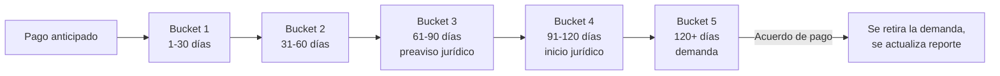

# 9. Gestión de cobranza por bucket de mora

[← Volver a Procesos](README.md)

La cartera se segmenta en seis estados. La gestión se mantiene activa en todos ellos mediante llamadas, correos y WhatsApp, y **la cobranza inicia desde la originación del crédito, no desde la mora**.

## Buckets de mora

| Bucket | Rango | Acciones principales |
|--------|-------|------------------------|
| Pago anticipado | Antes del vencimiento | Visita de originación; mensajes de bienvenida por WhatsApp (día -5, -3, -1, 0); visita de confirmación y verificación el día 25 (contacto, medios de pago, inventario) |
| Bucket 1 | 1–30 días | Llamada con guion estandarizado; WhatsApp informativo y luego con advertencia; preaviso formal de reporte negativo (día 15); priorización de visita según Comité de Cartera |
| Bucket 2 | 31–60 días | Llamada para negociar y dar seguimiento a compromisos; comunicaciones por WhatsApp y correo; aviso formal de reporte negativo (día 30) |
| Bucket 3 | 61–90 días | Email de preaviso de proceso jurídico |
| Bucket 4 | 91–120 días | Aviso formal de inicio de proceso jurídico (email y carta física); contacto directo del analista jurídico o abogado |
| Bucket 5 | 120+ días | Definición de cuantía y juzgado; radicación de la demanda; verificación de datos de notificación; canal de negociación solo dentro del proceso legal, condicionado a pago inicial y compromiso documentado |

## Comité de Cartera

| Frecuencia | Criterios de priorización |
|------------|----------------------------|
| Semanal | Días de mora (foco en 20+), flujo de caja y tipo de negocio, cuotas vencidas, historial y respuesta del cliente, monto adeudado alto |

## ⚠️ Nota de inconsistencia (pendiente de validar)

El journey de Colpatria B2B (junio 2026) describe un flujo **más corto** que el esquema de buckets anterior:

| Journey Colpatria B2B | Esquema de buckets (este documento) |
|---|---|
| Día 0: débito automático | — |
| Día 1–5: reintento | — |
| Día 6–15: WhatsApp/SMS, preaviso de reporte a 15 días | Bucket 1: preaviso día 15 |
| Día 16–30: llamada de confirmación de causa | Bucket 2: preaviso día 30 |
| Reporte a centrales (día 15/45) y **bloqueo permanente + jurídico desde día 30 de mora** | Escalamiento jurídico entre bucket 3 y 5, es decir **61 a 120+ días** |

Ambos flujos quedan documentados hasta que negocio y operaciones confirmen cuál está vigente (la misma nota aplica en [Reglas Negocio](../reglas-negocio.md)).
