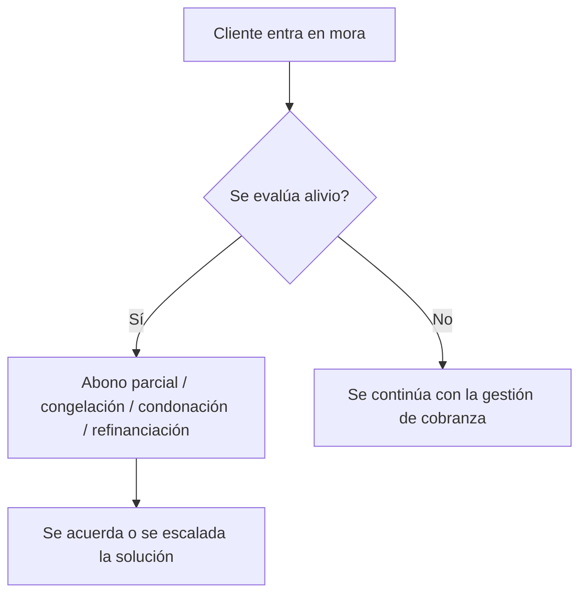

# 10. Alivios y negociación

[← Volver a Procesos](README.md)

| Documento | Alivios y negociación |
|-----------|--------------------------|
| **Proyecto** | Fliipa |
| **Versión** | 2.1 |
| **Estado** | Borrador para validación |
| **Responsable** | Cobranza y cartera |
| **Última actualización** | 2026-07-13 |

---

## Control de versiones

| Versión | Fecha | Autor | Descripción |
|---------|-------|-------|-------------|
| 1.0 | 2026-07-09 | María Fernanda Herazo  | Versión inicial, como sección 10 del `procesos.md` original (monolítico), con tres tipos de alivio. |
| 2.0 | 2026-07-13 | María Fernanda Herazo  | Reorganización en archivo independiente, dentro del split de `negocio/procesos/`. |
| 2.1 | 2026-07-13 | María Fernanda Herazo  | Se agrega **Refinanciación** como cuarto tipo de alivio, con base en `Speech llamada cobranza B2B.xlsx` y `Tipificaciòn.xlsx`, y en que ya aparecía citada en la tipificación de contactos de [Reglas Negocio](../reglas-negocio/03-alivios-negociacion.md) sin estar en esta lista. Se marca como pendiente de definir por negocio, porque ninguna de las fuentes revisadas especifica sus condiciones (monto mínimo, plazo, tratamiento de intereses o qué pasa ante incumplimiento), a diferencia de los otros tres tipos. |

## Objetivo

Ofrecer alternativas de alivio a los clientes que atraviesan mora, de forma que se pueda negociar una solución y evitar que el caso siga escalando sin una ruta definida.

## Descripción general

Durante la gestión de mora se pueden ofrecer cuatro tipos de alivio: abono parcial, congelamiento de intereses, condonación y refinanciación. Los tres primeros tienen reglas más claras y están documentados en Reglas de Negocio; la refinanciación, en cambio, se mantiene como una opción pendiente de definir por negocio porque no existen condiciones completas en las fuentes revisadas.

## Actores involucrados

- Cliente: solicita o acepta una alternativa de alivio.
- Cobranza y cartera: evalúan la propuesta y definen la ruta de negociación.
- Comité de Cartera: recibe los casos de refinanciación o escalamiento.
- Negocio: define las condiciones definitivas de la refinanciación.

## Flujo del proceso

## Explicación paso a paso

1. Identificación del caso en mora
   - Qué sucede: el cliente presenta retrasos de pago y entra en un proceso de negociación.
   - Qué actor interviene: cobranza y cliente.
   - Qué sistema participa: registros de cartera y seguimiento.
   - Qué información se utiliza: estado de mora y comportamiento de pago.
   - Qué decisión se toma: si es viable ofrecer un alivio.
   - Qué ocurre si el resultado es positivo: se evalúa la propuesta.
   - Qué ocurre si el resultado es negativo: el caso sigue con la gestión ordinaria.

2. Evaluación del tipo de alivio
   - Qué sucede: la cartera define si corresponde abono parcial, congelamiento, condonación o refinanciación.
   - Qué actor interviene: cobranza y cartera.
   - Qué sistema participa: gestión de cartera y documentos de negociación.
   - Qué información se utiliza: saldo, antigüedad y capacidad de pago del cliente.
   - Qué decisión se toma: si se ofrece una alternativa de alivio.
   - Qué ocurre si el resultado es positivo: se acuerda la solución.
   - Qué ocurre si el resultado es negativo: se mantiene la ruta de cobranza.

3. Acuerdo o escalamiento
   - Qué sucede: el alivio se concreta o se eleva al Comité de Cartera cuando no existe una política completa.
   - Qué actor interviene: comité de cartera y negocio.
   - Qué sistema participa: registro y seguimiento de acuerdos.
   - Qué información se utiliza: términos de la negociación y política vigente.
   - Qué decisión se toma: si se aprueba o no el alivio.
   - Qué ocurre si el resultado es positivo: se cierra la negociación.
   - Qué ocurre si el resultado es negativo: se mantiene la gestión de cobranza o se reevalúa el caso.

## Reglas de negocio

- Se pueden ofrecer cuatro tipos de alivio: abono parcial, congelación de intereses, condonación y refinanciación.
- Abono parcial, congelamiento y condonación cuentan con reglas más claras documentadas en [Reglas Negocio](../reglas-negocio/03-alivios-negociacion.md).
- La refinanciación debe escalarse al Comité de Cartera hasta que negocio defina sus condiciones.

## Entradas

- Caso en mora y estado del cliente.
- Historial de pagos y capacidad de pago del cliente.
- Reglas de negocio vigentes sobre alivios.

## Salidas

- Acuerdo de alivio o negociación.
- Escalación al comité de cartera cuando aplica.
- Continuación o cierre del caso de cobranza.

## Excepciones

- El cliente no necesita o no acepta un alivio.
- La refinanciación no puede ofrecerse sin condiciones claras.
- El caso no puede resolver con un alivio y debe continuar a cobranza.

## Consideraciones

- La refinanciación sigue siendo una opción pendiente de definir por negocio.
- El detalle de condiciones de abono parcial, congelamiento y condonación está en [Reglas Negocio](../reglas-negocio/03-alivios-negociacion.md).

## Pendientes de validación

> **Pendiente de validar con el dueño del proceso.** Las condiciones concretas de refinanciación deben definirse con negocio y cartera.
