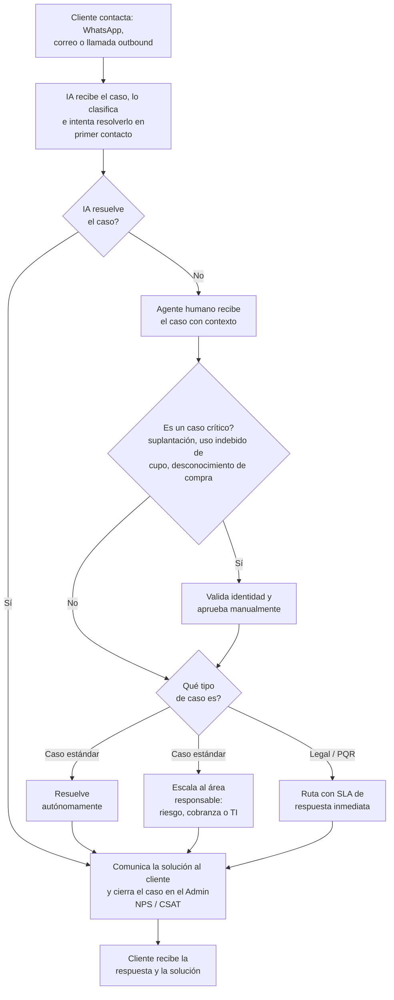

# 11. Servicio al cliente

[← Volver a Procesos](README.md)

| Documento | Servicio al cliente |
|-----------|------------------------|
| **Proyecto** | Fliipa |
| **Versión** | 2.1 |
| **Estado** | Borrador para validación |
| **Responsable** | Servicio al cliente / Riesgo |
| **Última actualización** | 2026-07-13 |

---

## Control de versiones

| Versión | Fecha | Autor | Descripción |
|---------|-------|-------|-------------|
| 1.0 | 2026-07-09 | María Fernanda Herazo (con asistencia de Claude) | Versión inicial, como sección 11 del `procesos.md` original (monolítico). |
| 2.0 | 2026-07-13 | María Fernanda Herazo (con asistencia de Claude) | Reorganización en archivo independiente con diagrama Mermaid, dentro del split de `negocio/procesos/`. |
| 2.1 | 2026-07-13 | María Fernanda Herazo (con asistencia de Claude) | Corrección de fondo tras validar contra la página 9 de `Journeys Fran finales.pdf`: la decisión final no es binaria "caso crítico vs. legal/PQR" — es un enrutamiento de 3 salidas (resolución autónoma, escalación a un área responsable, o legal/PQR). La validación de identidad para casos críticos se reubica como una acción previa del agente al recibir el caso, no como una salida alternativa a "Legal/PQR". Se agregan los nombres de las áreas de escalación (riesgo, cobranza, TI). |

## Objetivo

Atender los casos del cliente de forma rápida y responsable, resolviendo de primera línea o derivando correctamente a las áreas competentes cuando el tema requiere intervención humana.

## Descripción general

Todo caso del cliente puede llegar por WhatsApp, correo o llamada outbound. El asistente virtual intenta resolverlo en primer contacto; si no lo logra, un agente humano recibe el caso con contexto y decide si se resuelve de forma autónoma, se escalada a riesgo, cobranza o TI, o se deriva a legal/PQR. Los casos críticos requieren validación de identidad y aprobación manual antes de avanzar.

## Actores involucrados

- Cliente: reporta el caso y recibe la respuesta final.
- IA: clasifica y trata de resolver el caso en primer contacto.
- Agente humano: recibe el caso, valida identidad en casos críticos y decide el enrutamiento.
- Áreas internas: riesgo, cobranza y TI, además de legal/PQR cuando aplica.

## Flujo del proceso

## Referencia visual del journey

- Página 9 del journey Colpatria B2B (junio 2026): servicio al cliente, IA de primer nivel y escalamiento humano.
- Fuente visual de respaldo para validar la secuencia documentada en este proceso.

## Explicación paso a paso

1. Contacto del cliente
   - Qué sucede: el cliente reporta un caso por WhatsApp, correo o llamada outbound.
   - Qué actor interviene: cliente.
   - Qué sistema participa: canal de contacto y portal administrativo.
   - Qué información se utiliza: descripción del caso y contexto del cliente.
   - Qué decisión se toma: si el caso entra al proceso de servicio al cliente.
   - Qué ocurre si el resultado es positivo: el caso se registra y se clasifica.
   - Qué ocurre si el resultado es negativo: no se genera un caso.

2. Primer contacto con la IA
   - Qué sucede: la IA clasifica el caso e intenta resolverlo en primer contacto.
   - Qué actor interviene: IA.
   - Qué sistema participa: motor de clasificación y respuesta.
   - Qué información se utiliza: contexto del caso, historial y reglas de respuesta.
   - Qué decisión se toma: si la IA resuelve o no el reclamo.
   - Qué ocurre si el resultado es positivo: se cierra el caso.
   - Qué ocurre si el resultado es negativo: se escapa al agente humano.

3. Revisión humana del caso
   - Qué sucede: un agente humano recibe el caso con contexto y valida identidad si se trata de un caso crítico.
   - Qué actor interviene: agente humano.
   - Qué sistema participa: portal administrativo.
   - Qué información se utiliza: contexto del caso y verificación de identidad.
   - Qué decisión se toma: si el caso es estándar, crítico o legal/PQR.
   - Qué ocurre si el resultado es positivo: se resuelve o se enruta.
   - Qué ocurre si el resultado es negativo: se mantiene en espera o se escalada a la área responsable.

4. Enrutamiento final
   - Qué sucede: el caso se resuelve de forma autónoma, se deriva a riesgo/cobranza/TI o se envía a legal/PQR.
   - Qué actor interviene: agente humano y áreas internas.
   - Qué sistema participa: enrutamiento del caso y SLA.
   - Qué información se utiliza: tipo de caso y nivel de impacto.
   - Qué decisión se toma: qué área asume la respuesta.
   - Qué ocurre si el resultado es positivo: el cliente recibe la solución.
   - Qué ocurre si el resultado es negativo: se mantiene en seguimiento.

## Reglas de negocio

- Todo caso debe registrarse en el portal administrativo.
- La IA intenta resolver el caso en primer contacto.
- Los casos críticos requieren validación de identidad y aprobación manual.
- El enrutamiento final puede ser resolución autónoma, escalación a riesgo/cobranza/TI o legal/PQR.

## Entradas

- Caso reportado por WhatsApp, correo o llamada outbound.
- Contexto del cliente y del problema.
- Reglas de clasificación y routing del servicio.

## Salidas

- Caso resuelto o derivado.
- Respuesta al cliente con solución o seguimiento.
- Cierre del caso en el admin con métricas NPS/CSAT.

## Excepciones

- El caso no lo resuelve la IA y debe pasar a agente humano.
- El caso es crítico y requiere validación de identidad.
- El caso corresponde a legal/PQR y necesita SLA inmediato.
- Se detecta un fraude o uso indebido de cupo.

## Consideraciones

- El asistente virtual es una funcionalidad de largo plazo, pero el proceso ya contempla su uso en primer contacto.
- La decisión de enrutar el caso a riesgo, cobranza o TI debe mantenerse alineada con la estructura interna.

## Pendientes de validación

> **Pendiente de validar con el dueño del proceso.** La política exacta de escalación y los SLAs de legal/PQR deben confirmarse con operaciones y servicio al cliente.

## Fuentes consultadas

- `Journeys Fran finales.pdf` (Journeys Colpatria B2B, junio 2026), página 9 ("Servicio al cliente", swimlanes Cliente / IA / Agente humano / Áreas internas)
