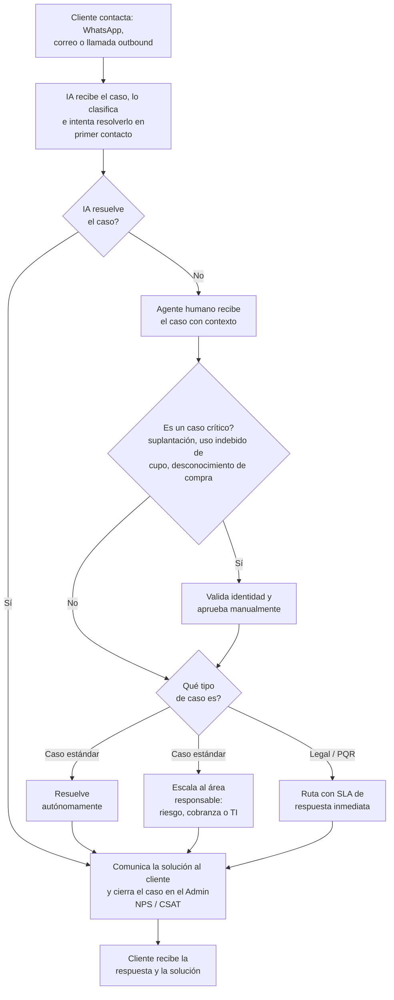

# 11. Servicio al cliente

[← Volver a Procesos](README.md)

| Documento | Servicio al cliente |
|-----------|------------------------|
| **Proyecto** | Fliipa |
| **Versión** | 2.1 |
| **Estado** | Borrador para validación |
| **Responsable** | Servicio al cliente / Riesgo |
| **Última actualización** | 2026-07-13 |

---

## Control de versiones

| Versión | Fecha | Autor | Descripción |
|---------|-------|-------|-------------|
| 1.0 | 2026-07-09 | María Fernanda Herazo (con asistencia de Claude) | Versión inicial, como sección 11 del `procesos.md` original (monolítico). |
| 2.0 | 2026-07-13 | María Fernanda Herazo (con asistencia de Claude) | Reorganización en archivo independiente con diagrama Mermaid, dentro del split de `negocio/procesos/`. |
| 2.1 | 2026-07-13 | María Fernanda Herazo (con asistencia de Claude) | Corrección de fondo tras validar contra la página 9 de `Journeys Fran finales.pdf`: la decisión final no es binaria "caso crítico vs. legal/PQR" — es un enrutamiento de 3 salidas (resolución autónoma, escalación a un área responsable, o legal/PQR). La validación de identidad para casos críticos se reubica como una acción previa del agente al recibir el caso, no como una salida alternativa a "Legal/PQR". Se agregan los nombres de las áreas de escalación (riesgo, cobranza, TI). |

---

## Flujo

Todo caso se registra en el portal administrativo. El asistente virtual es una funcionalidad de **largo plazo**; los agentes humanos se encargan de validar identidad y aprobar manualmente los casos críticos, y de decidir el enrutamiento final (resolución autónoma, escalación a un área, o legal/PQR).

## Fuentes consultadas

- `Journeys Fran finales.pdf` (Journeys Colpatria B2B, junio 2026), página 9 ("Servicio al cliente", swimlanes Cliente / IA / Agente humano / Áreas internas)
