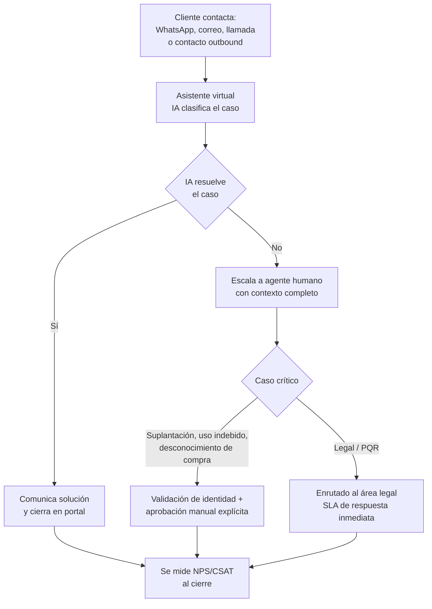

# 11. Servicio al cliente

[← Volver a Procesos](README.md)

## Flujo

Todo caso se registra en el portal administrativo. El asistente virtual se clasifica como una funcionalidad de **largo plazo**; los agentes humanos se encargan de validación de identidad y aprobación de casos críticos.
