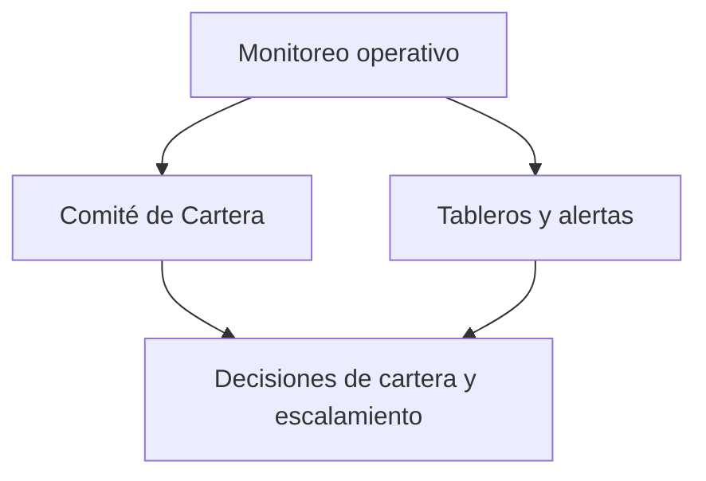

# 12. Gobernanza operativa transversal

[← Volver a Procesos](README.md)

| Documento | Gobernanza operativa transversal |
|-----------|--------------------------------------|
| **Proyecto** | Fliipa |
| **Versión** | 2.1 |
| **Estado** | Borrador para validación |
| **Responsable** | Negocio y operaciones |
| **Última actualización** | 2026-07-13 |

---

## Control de versiones

| Versión | Fecha | Autor | Descripción |
|---------|-------|-------|-------------|
| 1.0 | 2026-07-09 | María Fernanda Herazo| Versión inicial, como sección 12 del `procesos.md` original (monolítico). |
| 2.0 | 2026-07-13 | María Fernanda Herazo  | Reorganización en archivo independiente, dentro del split de `negocio/procesos/`. |
| 2.1 | 2026-07-13 | María Fernanda Herazo | Corrección tras validar contra [Actores](../Actores/04-comite-cartera.md) y [Reglas Negocio](../reglas-negocio/04-gestion-escalamiento.md): se separan Iván Aponte (Product Manager) y Alejandra Suárez (Account and Portfolio Specialist) como participantes distintos, en vez de un solo rol combinado con "/"; se marca explícitamente el "Senior Credit Strategy Analyst" como aún por definir; se completan las 5 funciones del Comité de Cartera (antes solo aparecía una). |

## Objetivo

Asegurar que las decisiones operativas, de riesgo y de cartera se tomen con visibilidad, seguimiento y responsabilidad transversal entre negocio, operaciones y áreas involucradas.

## Descripción general

La gobernanza operativa transversal se materializa en dos instancias principales: el Comité de Cartera, que revisa la cartera y define acciones de recuperación o escalamiento, y los tableros y alertas, que permiten monitorear en tiempo real el desempeño operativo y los indicadores clave del ciclo del crédito.

## Actores involucrados

- Iván Aponte: Product Manager y líder de la instancia de comité.
- Alejandra Suárez: Account and Portfolio Specialist.
- Senior Credit Strategy Analyst: rol pendiente de definir.
- Equipo Comercial y equipo de Cobranza: participan en tableros y alertas.

## Flujo del proceso

## Explicación paso a paso

1. Monitoreo operativo
   - Qué sucede: se revisa el desempeño de la cartera mediante indicadores y alertas.
   - Qué actor interviene: equipo comercial y equipo de cobranza.
   - Qué sistema participa: tableros y reportes de seguimiento.
   - Qué información se utiliza: indicadores de mora, riesgo y comportamiento del cliente.
   - Qué decisión se toma: si se requiere intervención adicional.
   - Qué ocurre si el resultado es positivo: se pasa a revisión del comité.
   - Qué ocurre si el resultado es negativo: se mantiene el seguimiento rutinario.

2. Comité de Cartera
   - Qué sucede: el comité revisa la cartera, prioriza casos y define estrategias de recuperación o escalamiento.
   - Qué actor interviene: Iván Aponte, Alejandra Suárez y el Senior Credit Strategy Analyst (por definir).
   - Qué sistema participa: información de cartera y decisiones de negocio.
   - Qué información se utiliza: comportamiento de la cartera, riesgo y compromisos operativos.
   - Qué decisión se toma: si se actúa sobre un caso o se ajusta la estrategia.
   - Qué ocurre si el resultado es positivo: se ejecutan las decisiones del comité.
   - Qué ocurre si el resultado es negativo: se deja la estrategia vigente.

3. Escalamiento y seguimiento
   - Qué sucede: los casos que requieren intervención jurídica o mayor control se escalan y se hacen seguimiento a los compromisos.
   - Qué actor interviene: comité, negocio y áreas operativas.
   - Qué sistema participa: registros de escalamiento y seguimiento.
   - Qué información se utiliza: estado del caso y riesgo operativo.
   - Qué decisión se toma: si se requiere intervención adicional.
   - Qué ocurre si el resultado es positivo: se avanza la gestión del caso.
   - Qué ocurre si el resultado es negativo: se mantiene el seguimiento actual.

## Reglas de negocio

- El Comité de Cartera se reúne de forma semanal.
- El comité analiza el comportamiento de la cartera, prioriza la gestión según el nivel de mora y riesgo y coordina el escalamiento al área jurídica.
- Los tableros y alertas deben asegurar que ningún cliente quede sin gestión durante el ciclo del crédito.

## Entradas

- Indicadores de cartera y riesgo.
- Información operativa de cobranza y comercial.
- Casos que requieren evaluación o escalamiento.

## Salidas

- Decisiones de cartera y recuperación.
- Escalamiento a las áreas responsables.
- Seguimiento operativo a los indicadores y compromisos.

## Excepciones

- Un caso no requiere intervención y se mantiene en seguimiento rutinario.
- Un caso requiere escalamiento jurídico o un cambio de estrategia.
- Falta de información o definición de rol en el comité.

## Consideraciones

- El rol de Senior Credit Strategy Analyst sigue pendiente de definir por negocio.
- La gobernanza operativa está conectada con los procesos de cobranza, alivios y escalamiento.

## Pendientes de validación

> **Pendiente de validar con el dueño del proceso.** La composición final del comité y la definición del rol pendiente deben confirmarse con negocio y operaciones.
