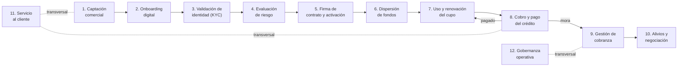

# Procesos

| Documento | Procesos |
|-----------|----------|
| **Proyecto** | Fliipa |
| **Versión** | 2.0 |
| **Estado** | Borrador para validación |
| **Responsable** | Negocio y operaciones |
| **Última actualización** | 2026-07-13 |

---

## Control de versiones

| Versión | Fecha | Autor | Descripción |
|---------|-------|-------|-------------|
| 0.1 | 2026-07-06 | Equipo Flipa | Borrador vacío (pendiente de completar). |
| 1.0 | 2026-07-09 | María Fernanda Herazo (con asistencia de Claude) | Primera versión completa del flujo operacional del crédito. |
| 1.1 | 2026-07-09 | María Fernanda Herazo (con asistencia de Claude) | Actualización de KYC y alivios; corrección de Actores y Reglas Negocio. |
| 1.2 | 2026-07-09 | María Fernanda Herazo (con asistencia de Claude) | Anexo con las 10 páginas de los Journeys Colpatria B2B (junio 2026). |
| 2.0 | 2026-07-13 | María Fernanda Herazo (con asistencia de Claude) | Reorganización: un archivo por etapa, con diagramas Mermaid y tablas en lugar de texto narrativo. |
| 2.1 | 2026-07-15 | María Fernanda Herazo | Referencias visuales incorporadas directamente en los procesos y eliminación del anexo independiente de journeys. |

---

## Objetivo

Mostrar el flujo operacional del crédito Fliipa, de la captación comercial al cierre o recuperación de la obligación, como referencia común para negocio, producto, tecnología y operaciones.

## Alcance

Cubre los procesos de negocio: captación comercial, onboarding, KYC, evaluación de riesgo, firma y activación, dispersión de fondos, uso y pago, cobranza y escalamiento jurídico, y servicio al cliente. No incluye reglas específicas (ver [Reglas Negocio](../reglas-negocio/README.md)) ni especificaciones técnicas (ver [Técnico](../../tecnico/README.md)).

## Mapa del flujo

## Etapas del proceso

| # | Etapa | Resumen | Documento |
|---|-------|---------|-----------|
| 1 | Captación comercial | Contacto simultáneo por correo, WhatsApp y llamada sobre clientes preaprobados de D1. | [01-captacion-comercial.md](01-captacion-comercial.md) |
| 2 | Onboarding digital | Registro del cliente y validación de datos en ~3 minutos. | [02-onboarding-digital.md](02-onboarding-digital.md) |
| 3 | Validación de identidad (KYC) | PIN, biometría (Olimpia), extractos y cuenta bancaria (Druo). | [03-validacion-kyc.md](03-validacion-kyc.md) |
| 4 | Evaluación de riesgo | Score Experian + histórico D1; aprueba, ajusta o rechaza el cupo. | [04-evaluacion-riesgo.md](04-evaluacion-riesgo.md) |
| 5 | Firma de contrato y activación | Revisión y firma del contrato/pagaré; asignación del bono. | [05-firma-contrato.md](05-firma-contrato.md) |
| 6 | Dispersión de fondos | Fiducia Colpatria; costo GMF (4x1000); bloqueo del remanente. | [06-dispersion-fondos.md](06-dispersion-fondos.md) |
| 7 | Uso y renovación del cupo | Uso del bono en D1 y evaluación de renovación por comportamiento. | [07-uso-renovacion-cupo.md](07-uso-renovacion-cupo.md) |
| 8 | Cobro y pago del crédito | Plan de pagos, prepago por PSE, cobro automático por Druo. | [08-cobro-pago.md](08-cobro-pago.md) |
| 9 | Gestión de cobranza por bucket de mora | 6 segmentos de mora con acciones diferenciadas; nota de inconsistencia con el journey Colpatria. | [09-cobranza.md](09-cobranza.md) |
| 10 | Alivios y negociación | Abono parcial, congelamiento de intereses, condonación. | [10-alivios.md](10-alivios.md) |
| 11 | Servicio al cliente | IA de primer nivel con escalamiento a agente humano. | [11-servicio-cliente.md](11-servicio-cliente.md) |
| 12 | Gobernanza operativa transversal | Comité de Cartera semanal, indicadores y tableros. | [12-gobernanza.md](12-gobernanza.md) |

## Documentos relacionados

- [Negocio](../README.md)
- [Flipa - Biblioteca de Conocimiento](../../README.md)
- [Mapa Del Conocimiento](../../MAPA_DEL_CONOCIMIENTO.md)
- [Onboarding](../../ONBOARDING.md)
- [Convenciones](../../CONVENCIONES.md)
- [Producto](../../producto/README.md)
- [Funcional](../../funcional/README.md)
- [Qa](../../qa/README.md)
 - [Descripcion Negocio](../descripcion_negocio/README.md)
 - [Actores](../Actores/README.md)
 - [Indicadores](../indicadores/README.md)
 - [Reglas Negocio](../reglas-negocio/README.md)

## Fuentes consultadas

- Alcance del Producto — [Alcance](../../producto/alcance.md)
- Journeys Colpatria B2B, junio 2026 — *Journeys Fran finales-1.pdf*
- Modelo Comercial B2B — *Modelo Comercial B2B.pptx*
- Modelo y Proceso de Cobranza B2B — *Modelo Cobranza/Modelo_de_Cobranza_B2B_.pptx* y *Modelo Cobranza/Modelo y gestion de cobranza.docx*
- Investigación B2B — *Modelo Cobranza/Investigacion B2B.docx*
- Reglas Negocio — [Reglas Negocio](../reglas-negocio/README.md)
