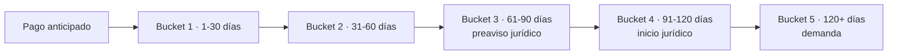

# 2. Reglas de mora y buckets

[← Volver a Reglas Negocio](README.md)

- La cartera se segmenta en seis estados: pago anticipado (antes del vencimiento), bucket 1 (1-30 días), bucket 2 (31-60 días), bucket 3 (61-90 días), bucket 4 (91-120 días) y bucket 5 (120+ días).
- Preaviso formal de reporte negativo: día 15 en mora.
- Aviso formal de reporte negativo a centrales de información: día 30 en mora.
- Preaviso de proceso jurídico: dentro del bucket 3 (61-90 días de mora).
- Aviso formal de inicio de proceso jurídico: dentro del bucket 4 (91-120 días de mora).
- Radicación de la demanda: a partir del bucket 5 (120+ días de mora).
- El cupo permanece bloqueado durante todo el periodo de mora.

> **Pendiente de validar (journey vs. buckets):** el journey de Colpatria B2B (junio 2026) describe una escalada más corta —bloqueo permanente del cupo y cobro jurídico desde el día 30 de mora—, distinta a los plazos de bucket anteriores (61 a 120+ días). Ambas reglas quedan documentadas hasta que el equipo confirme cuál está vigente. Ver la nota en [Procesos](../procesos/09-cobranza.md).

> **Pendiente de validar (cita legal):** *Mensajes WhatsApp B2B.xlsx* (hoja "B2B Comunicaciones") cita la **Ley 2157 de 2021, Art. 3** para la "2da notificación" al cliente en el día 20 de mora, dentro de una cadencia más granular (días 3, 6, 7, 10, 14, 17, 20, 23, 27, 30) que no coincide exactamente con los días 15/30 documentados arriba. Esta cita legal no estaba referenciada en el documento original; queda pendiente que negocio confirme si los días 15/30 de este documento y los días 17/20/30 de la cadencia de WhatsApp corresponden al mismo hito o son pasos distintos del mismo proceso de reporte.

## Fuentes consultadas

- Modelo y Proceso de Cobranza B2B — *Modelo Cobranza/Modelo_de_Cobranza_B2B_.pptx* y *Modelo Cobranza/Modelo y gestion de cobranza.docx*
- Mensajes WhatsApp B2B — *Mensajes WhatsApp B2B.xlsx* (hoja "B2B Comunicaciones": día 20, "2da notificación... Ley 2157 de 2021, Art. 3")
- Journeys Colpatria B2B, junio 2026 — *Journeys Fran finales-1.pdf*
