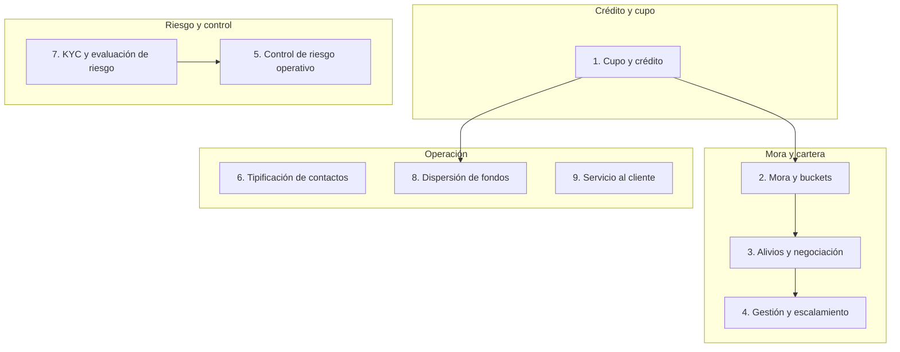

# Reglas Negocio

| Documento | Reglas Negocio |
|-----------|-----------------|
| **Proyecto** | Fliipa |
| **Versión** | 2.0 |
| **Estado** | En revisión |
| **Responsable** | Negocio y operaciones |
| **Última actualización** | 2026-07-15 |

---

## Control de versiones

| Versión | Fecha | Autor | Descripción |
|---------|-------|-------|-------------|
| 0.1 – 1.2 | 2026-07-06 a 2026-07-09 | María Fernanda Herazo | Historial completo en el documento monolítico anterior: reglas de cupo, mora, alivios, escalamiento jurídico, control de riesgo operativo, tipificación de contactos, KYC, dispersión de fondos y servicio al cliente. |
| 2.0 | 2026-07-15 | María Fernanda Herazo | Reorganización: un archivo por sección, siguiendo el mismo formato usado en [Actores](../Actores/README.md), [Procesos](../procesos/README.md) e [Indicadores](../indicadores/README.md). Se agrega diagrama de categorías. Se limpia la duplicación de las secciones "Dispersión de fondos" y "Servicio al cliente" que habían quedado repetidas al final del archivo original. Se agrega una nota pendiente de validar en la sección de mora y buckets: *Mensajes WhatsApp B2B.xlsx* (hoja "B2B Comunicaciones") cita la **Ley 2157 de 2021, Art. 3** para el día 20 de mora dentro de una cadencia más granular, que no coincide exactamente con los días 15/30 aquí documentados; esta cita legal no estaba referenciada en el documento original y queda pendiente de que negocio confirme cómo se relacionan ambos esquemas. |

---

## Objetivo

Documentar las reglas de negocio que rigen el otorgamiento, uso, mora y recuperación del crédito Fliipa, para mantener consistencia entre comercial, riesgo, cobranza y jurídico.

## Alcance

Cubre las reglas asociadas al cupo, la mora, los alivios y negociaciones, el escalamiento de cobranza y jurídico, el control de riesgo operativo, la tipificación de contactos, el KYC, la dispersión de fondos y el servicio al cliente. No incluye reglas de validación de campos ni de sistema, que se documentan en Funcional.

## Diagrama: categorías de reglas

## Secciones

| # | Sección | Resumen | Documento |
|---|---------|---------|-----------|
| 1 | Cupo y crédito | Cupo preaprobado, rotativo, hasta 3 cuotas, SLA de 72h. | [01-cupo-credito.md](01-cupo-credito.md) |
| 2 | Mora y buckets | 6 estados de cartera; plazos de reporte a centrales (Ley 2157); nota de inconsistencia con el journey Colpatria. | [02-mora-buckets.md](02-mora-buckets.md) |
| 3 | Alivios y negociación | Abono parcial, congelamiento de intereses, condonación. | [03-alivios-negociacion.md](03-alivios-negociacion.md) |
| 4 | Gestión y escalamiento | Comité de Cartera, registro de interacciones, indicadores compartidos. | [04-gestion-escalamiento.md](04-gestion-escalamiento.md) |
| 5 | Control de riesgo operativo | Validación de contacto, contrato estándar, visitas, tableros. | [05-control-riesgo-operativo.md](05-control-riesgo-operativo.md) |
| 6 | Tipificación de contactos y gestión | Taxonomía de canal, tipo de contacto, resultado y motivo. | [06-tipificacion-contactos.md](06-tipificacion-contactos.md) |
| 7 | KYC y evaluación de riesgo | Biometría automática, score Experian, validación de cuenta. | [07-kyc-evaluacion-riesgo.md](07-kyc-evaluacion-riesgo.md) |
| 8 | Dispersión de fondos | Fiducia Colpatria, costo GMF (4x1000). | [08-dispersion-fondos.md](08-dispersion-fondos.md) |
| 9 | Servicio al cliente | IA de primer nivel, casos críticos, PQR, NPS/CSAT. | [09-servicio-cliente.md](09-servicio-cliente.md) |

## Documentos relacionados

- [Negocio](../README.md)
- [Flipa - Biblioteca de Conocimiento](../../README.md)
- [Mapa Del Conocimiento](../../MAPA_DEL_CONOCIMIENTO.md)
- [Onboarding](../../ONBOARDING.md)
- [Convenciones](../../CONVENCIONES.md)
- [Producto](../../producto/README.md)
- [Funcional](../../funcional/README.md)
- [Qa](../../qa/README.md)
- [Descripcion Negocio](../descripcion_negocio/README.md)
- [Actores](../Actores/README.md)
- [Procesos](../procesos/README.md)
- [Indicadores](../indicadores/README.md)

## Fuentes consultadas

- Modelo y Proceso de Cobranza B2B — *Modelo Cobranza/Modelo_de_Cobranza_B2B_.pptx* y *Modelo Cobranza/Modelo y gestion de cobranza.docx*
- Mensajes WhatsApp B2B — *Mensajes WhatsApp B2B.xlsx* (hoja "B2B Comunicaciones", cita de Ley 2157 de 2021, Art. 3)
- Investigación B2B (`Modelo Cobranza/Investigacion B2B.docx`)
- Journeys Colpatria B2B, junio 2026 — *Journeys Fran finales-1.pdf*