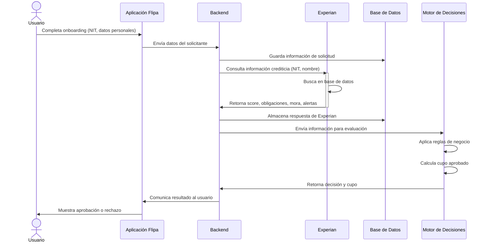

# Integración con Experian

## Objetivo

Describir cómo Flipa utiliza Experian dentro del flujo de originación de crédito para evaluar el riesgo crediticio de los solicitantes basándose en su historial crediticio, score y obligaciones financieras.

Experian es un proveedor de información crediticia que permite validar la solvencia del solicitante, reducir el riesgo de fraude y tomar decisiones informadas sobre el cupo de crédito a otorgar.

## Alcance

Los procesos que utilizan Experian son:

- **Evaluación del riesgo**: Consulta durante el flujo de originación después de que el solicitante completa el onboarding
- **Motor de decisiones**: Utiliza la información de Experian como entrada para calcular el cupo aprobado
- **Evaluación para renovación**: Consulta periódica para validar cambios en el perfil crediticio del cliente
- **Análisis de comportamiento**: Seguimiento de cambios en el score y obligaciones

Experian es consultado únicamente para personas jurídicas (empresas) representadas por su representante legal, en línea con la regulación crediticia colombiana.

## Flujo Funcional

El siguiente diagrama describe el flujo paso a paso desde que el usuario completa el onboarding hasta que se obtiene la respuesta de Experian:



### Paso a Paso

1. **Inicio de sesión y onboarding**: El usuario accede a través de enlace único y completa el registro con NIT, nombre del representante legal y datos adicionales

2. **Validación preliminar**: El sistema valida que el NIT corresponda a una empresa activa en el registro público

3. **Consulta de Experian**: El backend realiza una llamada a la API de Experian enviando el NIT del solicitante

4. **Procesamiento de respuesta**: Experian retorna información sobre el score crediticio, obligaciones, mora, alertas y otras variables

5. **Almacenamiento**: La respuesta se guarda en la base de datos con timestamp y referencia a la solicitud

6. **Evaluación de motor de decisiones**: El motor de decisiones recibe la información de Experian junto con datos de D1 y aplica reglas de negocio

7. **Cálculo de cupo**: Se calcula el cupo máximo disponible basado en la combinación de variables

8. **Comunicación del resultado**: El usuario recibe notificación de aprobación o rechazo

## Información Consultada

Experian proporciona la siguiente información sobre el solicitante:

### Score

**Definición**: Puntuación numérica que refleja la calidad crediticia de la persona jurídica basada en su historial de pagos y obligaciones.

**Rango**: Típicamente de 0 a 999 (dependiendo del modelo de Experian)

**Uso**: El motor de decisiones utiliza el score para determinar el cupo inicial y evaluar si el solicitante cumple los criterios mínimos de riesgo

**Interpretación**: 
- Score alto: Bajo riesgo crediticio
- Score medio: Riesgo moderado
- Score bajo: Alto riesgo crediticio

### Riesgo

**Definición**: Clasificación del nivel de riesgo de la persona jurídica en categorías predefinidas.

**Categorías**: Bajo, Medio, Alto (definidas por Experian)

**Uso**: Determina elegibilidad para ciertos productos o requisitos adicionales

### Obligaciones

**Definición**: Listado de todas las obligaciones crediticias conocidas de la persona jurídica en el sistema financiero.

**Incluye**:
- Créditos bancarios activos
- Tarjetas de crédito
- Obligaciones con entidades financieras no bancarias
- Otras obligaciones reportadas a las centrales

**Uso**: Valida la capacidad de endeudamiento y detecta sobreendeudamiento

### Mora

**Definición**: Información sobre pagos vencidos y no realizados.

**Incluye**:
- Indicador de mora presente
- Máximo número de días de mora
- Obligaciones en mora
- Fecha de última mora

**Uso**: Descalificante automático si existe mora superior a 30 días (sujeto a revisión por el equipo de riesgo)

### Alertas

**Definición**: Indicadores especiales de riesgo identificados por Experian.

**Ejemplos**:
- Fraude reportado
- Insolvencia
- Demanda legal
- Embargo
- Antecedentes penales relacionados con obligaciones financieras

**Uso**: Pueden ser motivo de rechazo automático o solicitud de revisión manual

### Variables Utilizadas por el Motor de Decisiones

El motor de decisiones utiliza las siguientes variables de Experian:

| Variable | Tipo | Rango | Uso |
|----------|------|-------|-----|
| Score Experian | Numérica | 0-999 | Entrada principal para cálculo de cupo |
| Categoría de Riesgo | Categórica | Bajo / Medio / Alto | Criterio de elegibilidad |
| Días de Mora Máximos | Numérica | 0-999 | Descalificante si > 30 |
| Total Obligaciones | Moneda | > 0 | Validación de capacidad de endeudamiento |
| Indicador de Alerta | Booleana | Sí / No | Descalificante si Sí |
| Antigüedad de Mora (días) | Numérica | 0-999 | Análisis de riesgo reciente |
| Número de Obligaciones | Numérica | 0-999 | Indicador de dispersión de deuda |

---

## Integración Técnica

### Tipo de API

- **Protocolo**: REST
- **Versión**: Según especificación de Experian
- **Formato**: JSON
- **Base URL**: Pendiente de confirmar en la documentación oficial de Experian

### Autenticación

- **Tipo**: API Key / OAuth 2.0 (Pendiente de confirmar con Experian)
- **Headers requeridos**: Authorization (Bearer token o API Key)
- **Renovación**: Tokens con validez de 24 horas (sujeto a confirmar)
- **Manejo de credenciales**: Almacenar en variables de entorno, nunca en código

### Entradas

**Endpoint**: `POST /api/v1/consultation` (ejemplo, Pendiente de confirmar)

**Parámetros requeridos**:
```json
{
  "nit": "800123456",
  "request_id": "uuid-único-solicitud",
  "timestamp": "2026-07-08T14:30:00Z",
  "client_id": "flipa-client-id"
}
```

**Parámetros opcionales**:
```json
{
  "full_name": "Nombre Representante Legal",
  "query_reason": "CREDIT_ORIGINATION",
  "additional_info": {}
}
```

### Salidas

**Respuesta exitosa** (HTTP 200):
```json
{
  "status": "success",
  "consultation_id": "exp-123456789",
  "applicant": {
    "nit": "800123456",
    "business_name": "Empresa ejemplo SAS"
  },
  "credit_profile": {
    "score": 750,
    "risk_category": "MEDIUM",
    "last_update": "2026-07-08"
  },
  "obligations": {
    "total_obligations": 5,
    "total_amount": 50000000,
    "obligations": [
      {
        "creditor": "Banco A",
        "amount": 20000000,
        "status": "ACTIVE",
        "days_overdue": 0
      }
    ]
  },
  "delinquency": {
    "has_delinquency": false,
    "max_days_overdue": 0,
    "recent_delinquency": false
  },
  "alerts": {
    "has_alerts": false,
    "alert_list": []
  }
}
```

### Manejo de Errores

| Código HTTP | Descripción | Acción Flipa |
|-------------|-------------|--------------|
| 200 | Consulta exitosa | Procesar respuesta normalmente |
| 400 | Parámetros inválidos (NIT malformado) | Registrar error y notificar al usuario |
| 401 | Autenticación fallida | Reintentar con nuevas credenciales |
| 403 | Acceso denegado | Escalar a equipo de integraciones |
| 404 | NIT no encontrado en base de datos | Permitir continuación con análisis limitado |
| 429 | Rate limit excedido | Implementar backoff exponencial |
| 500 | Error del servidor Experian | Reintentar máximo 3 veces con delay |
| 503 | Servicio no disponible | Usar datos en caché si existen (máximo 48 horas) |

**Estrategia de reintentos**:
- Máximo 3 intentos
- Backoff exponencial: 2s, 4s, 8s
- Registrar todos los intentos para auditoría

**Errores específicos de Experian** (Pendiente de confirmar con documentación oficial):
```json
{
  "error_code": "NIT_NOT_FOUND",
  "error_message": "El NIT no existe en la base de datos de Experian",
  "recommendation": "Validar formato del NIT"
}
```

---

## Costos

| Concepto | Valor | Responsable | Observaciones |
|----------|-------|-------------|---------------|
| Tarifa por consulta | Pendiente de confirmar | Iván Aponte | Se facturará por cada consulta exitosa realizada a Experian |
| Setup inicial | Pendiente de confirmar | Iván Aponte | Costos de integración y configuración |
| Soporte técnico | Pendiente de confirmar | Iván Aponte | SLA y costos de soporte 24/7 |
| Volumen mínimo mensual | Pendiente de confirmar | Iván Aponte | Posibles compromisos de volumen mínimo |

**Nota importante**: Los costos definidos serán suministrados por Iván Aponte una vez se formalice el contrato comercial con Experian. Estos valores están pendiente de confirmar y no deben utilizarse para presupuestos hasta tener validación formal.

---

## Dependencias

### Dependencias Internas

- **Base de Datos**: Tabla `credit_inquiries` para almacenar consultas y respuestas
- **Motor de Decisiones**: Sistema que utiliza la información de Experian
- **Logger**: Sistema de auditoría y logging
- **Cache**: Redis para almacenar respuestas recientes (opcional, para optimizar)

### Dependencias Externas

- **Experian API**: Servicio externo de información crediticia
- **Conectividad**: Acceso a internet y resolución DNS

### Integraciones Relacionadas

- [D1](D1.md) - Información transaccional complementaria
- [Olimpia](Olimpia.md) - Validación de identidad previa

---

## Riesgos

| Riesgo | Probabilidad | Impacto | Mitigación |
|--------|-------------|--------|-----------|
| Experian no dispone de información del NIT | Media | Bajo | Permitir continuar con análisis de D1 únicamente |
| Falsos positivos en detección de fraude | Baja | Alto | Implementar revisión manual de casos flagueados como fraude |
| Dependencia de servicio externo | Media | Alto | Implementar fallback logic y usar datos en caché |
| Latencia en respuesta de Experian > 5s | Media | Medio | Establecer timeout e implementar reintentos |
| Cambios en estructura de respuesta de API | Baja | Alto | Establecer versionamiento y comunicación previa |
| Experian rechaza consultas por validación | Media | Medio | Validar formato de datos antes de enviar |
| Costos superiores a presupuesto | Media | Alto | Implementar límites de consultas diarias |

---

## SLA

| Métrica | Target | Responsabilidad |
|---------|--------|-----------------|
| Disponibilidad de servicio Experian | Pendiente de confirmar | Experian |
| Tiempo de respuesta | Pendiente de confirmar (típicamente < 2s) | Experian |
| Consultas exitosas | Pendiente de confirmar (típicamente > 99.5%) | Experian |
| Ventana de mantenimiento | Pendiente de confirmar | Experian |

**Validación**: Se deben definir formalmente en el contrato comercial con Experian.

---

## Seguridad

### Protección de Datos

- **Encriptación en tránsito**: TLS 1.2+ para todas las conexiones
- **Encriptación en reposo**: Datos de Experian encriptados en base de datos
- **Validación de certificados**: Verificar certificados SSL/TLS válidos
- **Tokens**: Nunca incluir en logs o mensajes de error

### Validación

- **Validar formato de NIT**: Debe cumplir formato colombiano (10-12 dígitos)
- **Validar respuestas**: Verificar estructura y tipos de datos
- **Rate limiting**: Máximo X consultas por IP/cliente por minuto (Pendiente de definir)

### Auditoría

- **Logging**: Registrar todas las consultas (NIT, timestamp, usuario, resultado)
- **Retención**: Mantener logs mínimo 3 años
- **Acceso**: Restringir acceso a logs a personal autorizado
- **Cumplimiento**: GDPR, CCPA, normativa crediticia colombiana

### Manejo de Datos Sensibles

- No almacenar credenciales de Experian en código
- No incluir información sensible en URLs
- Implementar PII (Personally Identifiable Information) masking en logs
- Cumplir con HABEAS (derecho al olvido)

---

## Documentación Relacionada

- [Producto/Alcance](../../producto/alcance.md) - Contexto general del proyecto
- [Producto/Vision](../../producto/vision.md) - Visión y objetivos del producto
- [Funcional/Evaluación de Riesgo](../../funcional/casos-de-uso.md) - Casos de uso relacionados
- [Tecnico/Arquitectura](../arquitectura.md) - Arquitectura general del sistema
- [Tecnico/D1](D1.md) - Integración con datos transaccionales
- [Tecnico/Olimpia](Olimpia.md) - Validación de identidad
- [Tecnico/CoreBancario](CoreBancario.md) - Administración del crédito

---

## Control de Versiones

| Versión | Fecha | Autor | Descripción |
|---------|-------|-------|-------------|
| 1.0 | 2026-07-08 | Equipo Técnico | Documento inicial. Especificación técnica preliminar pendiente de validación con Experian. |

---

## Estado

**Borrador** - Pendiente de revisión y validación con Experian
