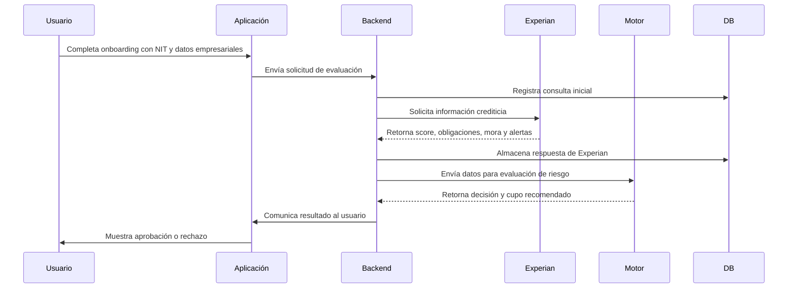

# Integración con Experian

## Objetivo

Describir cómo Flipa utiliza Experian dentro del flujo de originación de crédito para evaluar el riesgo crediticio del solicitante y apoyar las decisiones de cupo.

Experian se utiliza para obtener información oficial de riesgo, score, obligaciones y alertas que complementan los datos transaccionales y permiten una decisión más sólida.

## Alcance

Los procesos que utilizan Experian son:

- Evaluación del riesgo durante la originación de crédito.
- Motor de decisiones para cálculo de cupo aprobado.
- Validación de capacidad de endeudamiento.
- Revisión de cambios en línea crediticia al considerar renovación o reactivación de crédito.

## Flujo funcional

### Paso a paso

1. El usuario finaliza el onboarding y sus datos son validados preliminarmente.
2. El backend prepara la consulta a Experian con el NIT y datos de la persona jurídica.
3. Se ejecuta la llamada a Experian y se recibe el reporte crediticio.
4. La información es almacenada en la base de datos para trazabilidad.
5. El motor de decisiones utiliza los resultados de Experian junto con los datos de otras fuentes.
6. Se calcula el cupo aprobado.
7. El resultado se comunica al usuario.

## Información consultada

### Score

- **Definición**: Puntuación crediticia que determina la probabilidad de cumplimiento de obligaciones.
- **Uso**: Entrada principal del motor de decisiones para evaluar el riesgo.
- **Interpretación**: Score alto indica menor riesgo; score bajo indica mayor probabilidad de incumplimiento.

### Riesgo

- **Definición**: Clasificación del nivel de riesgo crediticio.
- **Uso**: Determina la elegibilidad y posibles ajustes de cupo.

### Obligaciones

- **Definición**: Compromisos financieros reportados en centrales de riesgo.
- **Incluye**: Créditos vigentes, tarjetas, leasing, y otras deudas.
- **Uso**: Permite calcular capacidad de pago y detectar sobreendeudamiento.

### Mora

- **Definición**: Información sobre obligaciones en atraso.
- **Incluye**: Días de mora, obligaciones en mora y fechas relevantes.
- **Uso**: Criterio de rechazo o reconsideración.

### Alertas

- **Definición**: Indicadores de eventos de riesgo como fraude, insolvencia o embargo.
- **Uso**: Soporte para decisiones de revisión manual o rechazo inmediato.

### Variables utilizadas por el motor de decisiones

| Variable | Tipo | Uso |
|----------|------|-----|
| Score Experian | Numérica | Cálculo de riesgo y cupo |
| Categoría de riesgo | Categórica | Elegibilidad y reglas adicionales |
| Total obligaciones | Moneda | Capacidad de endeudamiento |
| Días de mora máximos | Numérica | Reglas de rechazo |
| Alertas activas | Booleana | Revisión manual o rechazo |
| Número de obligaciones | Numérica | Análisis de dispersión de deuda |

## Integración técnica

- **Tipo de API**: REST
- **Formato**: JSON
- **Autenticación**: API Key / OAuth 2.0 (Pendiente de confirmar)
- **Base URL**: Pendiente de confirmar

### Entradas

- NIT de la empresa
- Nombre de la persona jurídica
- Identificador de solicitud
- Timestamp de la petición
- Motivo de la consulta

### Salidas

- Score crediticio
- Categoría de riesgo
- Detalle de obligaciones
- Información de mora
- Alertas activas
- Metadata de la consulta

### Manejo de errores

| Código HTTP | Descripción | Acción |
|-------------|-------------|--------|
| 200 | Consulta exitosa | Procesar respuesta |
| 400 | Parámetros inválidos | Revisar datos de entrada |
| 401 | Autenticación fallida | Verificar credenciales |
| 403 | Acceso denegado | Escalar a integraciones |
| 404 | NIT no encontrado | Revisar NIT |
| 429 | Límite excedido | Reintentar con backoff |
| 500 | Error interno | Reintentar y alertar |

- Reintentar máximo 3 veces con backoff exponencial.
- Registrar todos los intentos.

## Costos

| Concepto | Valor | Responsable | Observaciones |
|----------|-------|-------------|---------------|
| Tarifa por consulta | Pendiente de confirmar | Iván Aponte | Costos definidos al formalizar contrato comercial |
| Setup inicial | Pendiente de confirmar | Iván Aponte | Configuración e integración |
| Soporte | Pendiente de confirmar | Iván Aponte | Nivel de servicio y soporte técnico |
| Volumen mínimo | Pendiente de confirmar | Iván Aponte | Posibles compromisos de volumen |

> Nota: Los costos serán suministrados por Iván Aponte una vez se formalice el contrato comercial con Experian.

## Dependencias

- Base de datos para almacenar respuestas de Experian.
- Motor de decisiones para procesar resultados.
- Sistema de logging para auditoría.
- Conectividad externa con Experian.

## Riesgos

- Dependencia de un proveedor externo para la evaluación crediticia.
- Latencia en respuestas que afecte el tiempo de origen.
- Información incompleta para NITs sin historial.
- Cambios en la API de Experian.

## SLA

- Disponibilidad y tiempos de respuesta: Pendiente de confirmar.
- Consultas exitosas: Pendiente de confirmar.

## Seguridad

- TLS 1.2+ en todas las comunicaciones.
- No almacenar credenciales en código.
- Encriptación de datos en reposo.
- Registro seguro de transacciones.

## Documentación relacionada

- [Producto/Alcance](../../producto/alcance.md)
- [Producto/Vision](../../producto/vision.md)
- [Funcional/Casos de Uso](../../funcional/casos-de-uso.md)
- [Tecnico/Arquitectura](../arquitectura.md)
