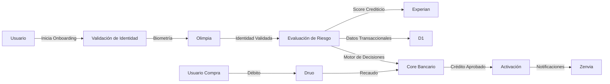

# Integraciones

## Objetivo

Documentar en detalle todas las integraciones técnicas que hacen parte de la plataforma Flipa, incluyendo propósito, flujos funcionales, especificaciones técnicas, costos y riesgos asociados.

## Alcance

Esta carpeta contiene la documentación técnica de cada uno de los sistemas externos integrados con Flipa durante el MVP y fases posteriores.

## Responsable

Pendiente de asignación

## Fecha de actualización

2026-07-08

## Estado

En construcción

## Documentos relacionados

- [Tecnico](../README.md)
- [Arquitectura](../arquitectura.md)
- [Apis](../apis.md)
- [Producto/Alcance](../../producto/alcance.md)

## Contenido

Esta carpeta contiene la documentación de las siguientes integraciones:

### Originación de Crédito

- [Experian](Experian.md) - Consulta de riesgo crediticio y evaluación de capacidad de endeudamiento
- [Olimpia](Olimpia.md) - Validación biométrica y verificación de identidad (KYC)
- [D1](D1.md) - Información transaccional y datos de utilización del bono

### Pagos y Cobranza

- [Druo](Druo.md) - Débito automático para el recaudo de pagos
- [Zenvia](Zenvia.md) - Gestión de notificaciones y comunicaciones con clientes

### Administración del Crédito

- [Core Bancario](CoreBancario.md) - Originación y administración del crédito rotativo

---

## Matriz de Integraciones

| Sistema | Categoría | Propósito | Criticidad |
|---------|-----------|-----------|-----------|
| Experian | Evaluación de Riesgo | Consulta de score y obligaciones crediticias | Alta |
| Olimpia | Validación de Identidad | Biometría y KYC | Alta |
| D1 | Datos Transaccionales | Información transaccional y utilización de bono | Alta |
| Druo | Pagos | Débito automático para recaudo | Alta |
| Zenvia | Comunicaciones | Notificaciones y comunicaciones con clientes | Media |
| Core Bancario | Administración | Originación y administración del crédito | Alta |

---

## Flujo General de Integraciones

---

## Estándares de Integración

- **Autenticación**: OAuth 2.0 / API Keys según lo especifique cada proveedor
- **Formato de datos**: JSON
- **Manejo de errores**: Códigos HTTP estándar + códigos específicos del proveedor
- **Reintentos**: Implementar backoff exponencial
- **Logging**: Registrar todas las transacciones para auditoría y troubleshooting
- **Seguridad**: TLS 1.2+, validación de certificados, tokenización de datos sensibles

---

## Próximos Pasos

- [ ] Completar documentación técnica de cada integración
- [ ] Definir SLAs con cada proveedor
- [ ] Establecer costos y modelos de facturación
- [ ] Crear guías de troubleshooting y runbooks
- [ ] Documentar planes de contingencia
